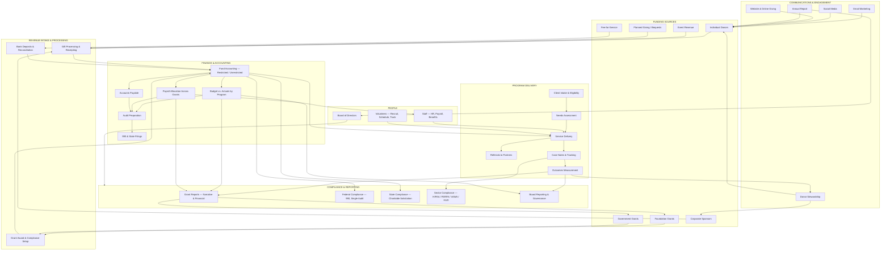
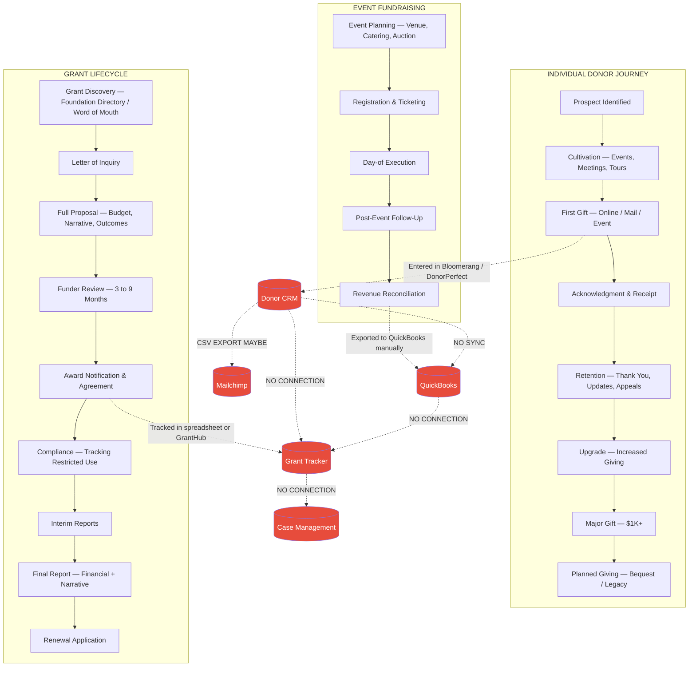
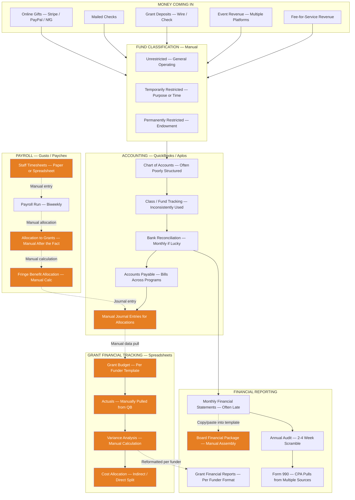
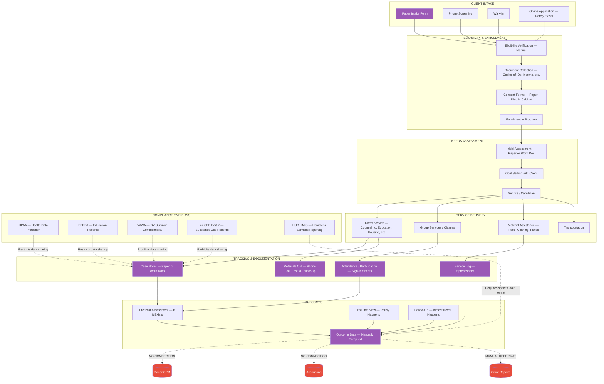
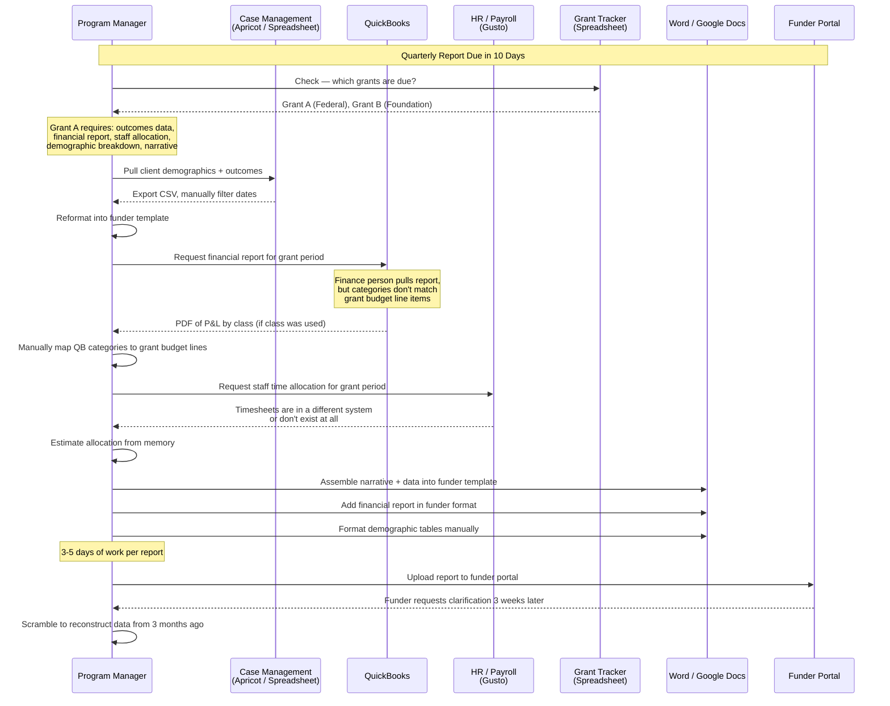
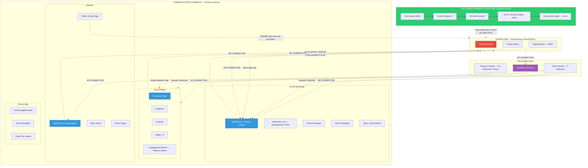
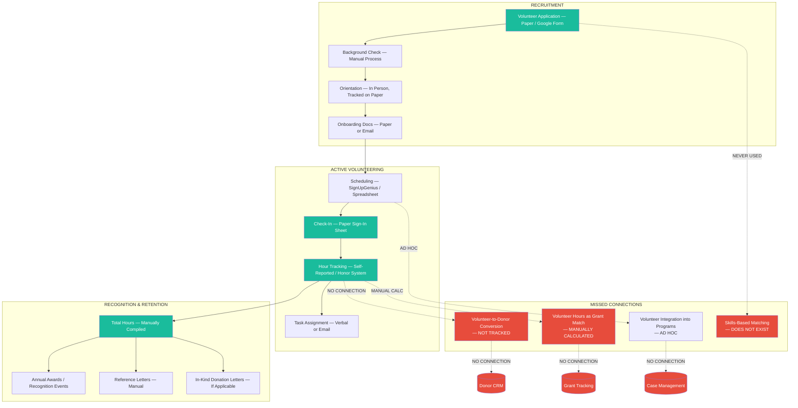
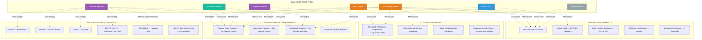
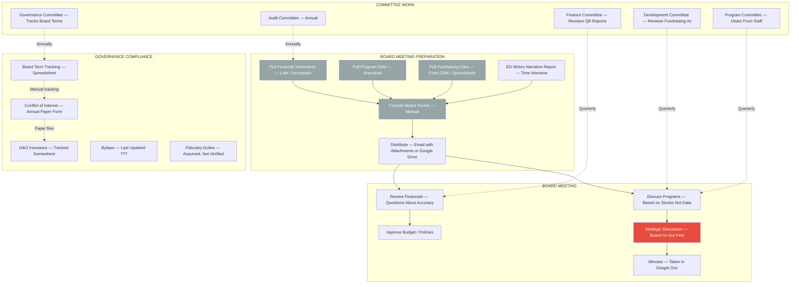
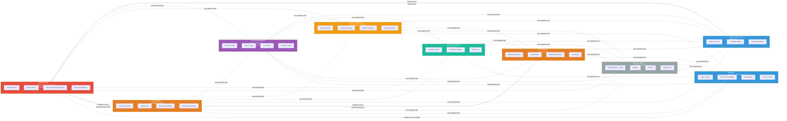

# Doc 1 of 3: The Current Landscape — Everything That's Broken

## A Brutally Honest Map of Small-to-Mid 501(c)(3) Operations ($500K--$5M Budget)

---

## 1. The Full Operational Pipeline



**What Should Happen:** Every functional area feeds data seamlessly into the others. A dollar donated by an individual is tracked from receipt through allocation to a specific program, connected to outcomes delivered by that program, and reported back to the donor showing impact. Grant funds flow through fund accounting, get allocated to staff time and direct services, produce measurable outcomes, and generate compliant reports. The board sees real-time dashboards. The cycle is continuous and self-reinforcing.

**What Actually Happens:** Each box in this diagram is a separate system, spreadsheet, or someone's memory. Data enters one system and must be manually re-entered into the next. Most connections shown above do not actually exist in practice. The "pipeline" is really a series of disconnected puddles, each maintained by a different staff member, with data transferred via email attachments, CSV exports, and sticky notes.

**Why It's Broken:**
- No single system of record exists for the entire operation
- Each functional area was tooled independently, often years apart, often by different staff who have since left
- Nonprofit software vendors build point solutions, not platforms (Bloomerang does donor CRM, not accounting; QuickBooks does accounting, not fund tracking)
- Integration budgets are zero; IT staff is zero
- The Executive Director is the only person who holds the full picture, and they hold it in their head

---

## 2. The Fundraising & Donor Pipeline (Broken)



**What Should Happen:** A prospect enters the pipeline, receives personalized cultivation based on their interests and capacity. When they give, the gift is automatically recorded in the CRM, synced to accounting, and tied to a specific program. As that program produces outcomes, the donor receives impact reports ("Your $500 provided tutoring for 3 students who improved reading levels by 1.5 grades"). Grant data flows from discovery through compliance with deadlines auto-tracked and outcomes data pulled directly from program systems. Event attendees are automatically added to the donor pipeline for follow-up.

**What Actually Happens:** The Development Director tracks prospects in a personal spreadsheet or maybe in Bloomerang. When a gift comes in online, it hits the payment processor (Stripe, PayPal, Network for Good) and may or may not auto-sync to the CRM. Checks arrive in the mail and get entered manually -- sometimes days later. The gift receipt goes out, but no one connects it to a specific program outcome because that data lives in a completely different system (or doesn't exist at all). Grant deadlines are tracked in Google Calendar or an Excel spreadsheet by one person. When that person is on vacation, deadlines get missed. Event attendees are tracked in Eventbrite, which doesn't talk to the CRM, so post-event follow-up requires manual export/import that often doesn't happen.

**Why It's Broken:**
- Bloomerang and DonorPerfect have no native integration with QuickBooks that handles fund accounting properly -- gifts sync as lump deposits, losing donor-level detail
- Online giving platforms (Network for Good, Classy, GiveLively) each create their own donor records that must be manually deduplicated with the CRM
- Grant tracking lives in spreadsheets because dedicated grant management tools (GrantHub, Fluxx) don't connect to the CRM or accounting
- Eventbrite / GiveSmart / OneCause are event islands -- attendee data requires manual CSV export to get into the CRM
- No system connects donor giving to program outcomes, making impact reporting a fiction-writing exercise
- Donor retention rate for small nonprofits averages 45% (vs. 80%+ in comparable commercial subscription businesses) -- largely because nonprofits cannot demonstrate impact to donors
- Planned giving is almost never pursued because organizations lack the donor data history and cultivation tracking to identify candidates

---

## 3. The Finance & Accounting Pipeline (Broken)



**What Should Happen:** Revenue is automatically classified by fund/restriction when it enters the system. The chart of accounts is structured to produce grant-level, program-level, and functional expense reporting without manual reclassification. Payroll is allocated to grants in real time based on timesheets. Grant budget-vs-actuals reports are generated on demand. Monthly close takes 2-3 days. The 990 and audit are largely automated exports.

**What Actually Happens:** Gifts arrive through 3-5 different channels and must be manually classified by restriction type. QuickBooks was set up years ago by someone who didn't understand nonprofit fund accounting, so the chart of accounts is a mess. "Class" tracking in QuickBooks is used inconsistently -- sometimes by program, sometimes by grant, sometimes by funding source, sometimes not at all. Payroll runs through Gusto or Paychex with no connection to grant budgets; a finance person manually calculates allocation percentages in a spreadsheet after the fact and enters journal entries. Grant budget-vs-actuals tracking happens in Excel, with actuals manually pulled from QuickBooks each month. Monthly close takes 2-3 weeks. Audit prep is a 4-week crisis. The 990 costs $8K-$15K because the CPA has to reconstruct functional expense allocation from scratch.

**Why It's Broken:**
- QuickBooks (even Online) was designed for small businesses, not fund accounting -- it lacks native support for restriction tracking, functional expense allocation, and grant-level reporting
- Aplos and similar nonprofit-specific tools are better at fund accounting but lack the payroll integrations and ecosystem of QuickBooks
- Payroll systems (Gusto, Paychex, ADP) have zero concept of grant-based allocation -- they process payroll by employee, not by funding source
- Time tracking tools (Toggl, Harvest, even paper timesheets) don't connect to either payroll or accounting, creating a three-system manual reconciliation for every pay period
- No affordable system tracks grant budgets with live actuals from the general ledger -- this is always a spreadsheet
- Cost allocation plans (indirect rate calculations, shared cost distribution) are done annually in a spreadsheet and applied retroactively, often incorrectly
- The average small nonprofit's monthly close is 15-25 business days behind -- meaning the board and ED are always making decisions on stale financial data

---

## 4. The Program Delivery & Case Management Pipeline (Broken)



**What Should Happen:** Clients complete intake digitally. Eligibility is checked against program criteria automatically. Consent and compliance requirements are tracked per client per program. Services are logged in real time. Referrals to partner organizations are tracked with follow-up. Pre/post assessments are automated and produce aggregate outcome metrics. Those metrics flow directly into grant reports and donor communications. Compliance with HIPAA, FERPA, VAWA, and other regulations is enforced by the system architecture, not by staff memory.

**What Actually Happens:** Clients fill out paper intake forms that sit in a pile until someone enters them into a spreadsheet, a Word document, or maybe Apricot Social Solutions if the organization is lucky enough to have it. Case notes are kept in paper files or Word documents saved to a shared drive with no naming convention. Attendance is tracked via paper sign-in sheets that may or may not get entered into a system. Referrals to partner agencies happen by phone; whether the client followed through is rarely tracked. Outcomes measurement -- the thing every funder asks about -- is assembled after the fact by a program manager pulling from paper files, spreadsheets, and memory, then formatted into whatever template each funder requires. HIPAA compliance is "we keep the files locked." VAWA compliance is "we don't share the files." There is no audit trail.

**Why It's Broken:**
- Apricot (now Bonterra Social Solutions), Penelope, and ETO are expensive ($5K-$25K/year) and require significant configuration that most small nonprofits cannot afford or staff
- Many organizations default to spreadsheets or paper because case management software was never purchased, or was purchased and never properly implemented
- HMIS (the HUD-mandated homeless services database) is its own silo with its own data entry requirements, duplicating work for CoC-funded programs
- Compliance requirements (HIPAA, FERPA, VAWA, 42 CFR Part 2) create legitimate barriers to data integration -- but they don't prohibit aggregate, de-identified outcome reporting, which organizations fail to do anyway
- Program staff are direct service providers first; they were not hired for data entry and resent it
- Client-facing technology (online intake, client portals) is almost nonexistent in the $500K-$5M budget range
- Referral tracking across organizations is essentially unsolved -- no shared system exists, and privacy regulations make cross-org data sharing genuinely complex
- The disconnection between case management and donor CRM means the organization literally cannot tell a donor what their gift accomplished

---

## 5. The Grant Reporting Pipeline (Broken)



**What Should Happen:** When a grant report is due, the system generates a draft automatically. Outcome data is pulled from case management. Financial data is pulled from accounting, already mapped to the grant's budget categories. Staff allocation is calculated from time tracking. The program manager reviews, adds narrative context, and submits. Total time: 2-4 hours per report.

**What Actually Happens:** The program manager (or worse, the ED) spends 3-5 full days per quarterly report. They pull data from 4-8 different systems, none of which use the same categories, date ranges, or formats. Financial data from QuickBooks must be manually reconciled to grant budget line items because the chart of accounts doesn't match the grant budget. Staff allocation is estimated because actual time tracking against grants doesn't exist. Outcomes data is assembled from paper files and spreadsheets. Every funder has a different template, different metrics, different reporting periods. The final product is a Word document or PDF manually uploaded to each funder's portal. When the funder asks a clarifying question two months later, the staff member has to reconstruct the data trail from scratch.

**Why It's Broken:**
- Each funder defines their own outcome metrics, budget categories, reporting periods, and templates -- there is no standard
- Federal grants (SAMHSA, HHS, DOJ, HUD) each have their own reporting portals and formats
- Foundation grants typically require narrative reports in funder-specific templates
- No system connects case management outcomes to grant reporting -- this is always a manual translation
- QuickBooks chart of accounts never matches grant budget line items, requiring manual crosswalk every reporting period
- Time tracking against specific grants is either not done or done on paper timesheets that are not connected to any digital system
- The "grant tracking spreadsheet" tracks deadlines but not the data needed to actually produce reports
- Organizations with 5-10 active grants can spend 30-60 staff days per year on reporting alone
- GrantHub and Fluxx track the application and deadline side, not the reporting and data assembly side

---

## 6. The Communications & Donor Engagement Pipeline (Broken)



**What Should Happen:** Communications are driven by data. Donors receive personalized updates based on which programs they fund. Email lists sync with the CRM in real time. A donor who gives to the after-school program receives outcome data from that program. Social media content is planned around program milestones and outcomes. The website dynamically displays impact metrics. The annual report is generated from live data. Every communication reinforces the feedback loop: your gift produced this outcome.

**What Actually Happens:** The communications person (if one exists -- often this is 10% of the Development Director's job) maintains a Mailchimp list that was imported from the CRM six months ago and is now out of sync. Email campaigns go to everyone regardless of their interests or giving history. Social media is posted when someone remembers to do it, using photos from someone's phone. The website was last updated when it was built. The annual report is a 3-month production process requiring manual data gathering from every department. No donor ever receives a personalized impact report tied to their specific gift. The feedback loop that drives retention and upgrade giving simply does not exist.

**Why It's Broken:**
- Mailchimp/Constant Contact have CRM-like features that conflict with the actual CRM, creating duplicate and competing donor records
- Bloomerang and DonorPerfect have email capabilities, but they are inferior to dedicated email tools, so staff use both -- and sync neither
- Social media platforms provide no mechanism to connect engagement to donor records
- Website platforms (WordPress, Squarespace) are content silos with no data connections
- Online giving widgets (embedded on the website) may sync to the CRM but lose attribution data (which campaign? which appeal?)
- Program outcome data lives in case management and is never surfaced to the communications team
- No one has time to write personalized impact reports because assembling the data is a manual research project for each donor
- The annual report takes 80-120 hours to produce because every data point must be manually gathered, verified, and formatted

---

## 7. The Volunteer Management Pipeline (Broken)



**What Should Happen:** Volunteers apply through a portal that feeds into a volunteer management system. Background checks are initiated and tracked automatically. Scheduling is done through a shared system that matches volunteer skills and availability to program needs. Hours are tracked digitally and automatically counted toward grant matching requirements. Volunteer data flows into the donor CRM so that high-engagement volunteers are cultivated as donor prospects. Volunteer hours at a federally valued rate ($31.80/hour in 2024) are automatically calculated as in-kind match for applicable grants.

**What Actually Happens:** Volunteer applications come in through Google Forms or paper. Background checks are ordered manually, and whether they were completed is tracked in a spreadsheet -- or not tracked at all, creating compliance liability. Scheduling happens through SignUpGenius or email chains. Hours are self-reported on paper sign-in sheets that get filed in a drawer. Total hours are compiled once a year for the annual report by someone counting sign-in sheets. Volunteers who are also donors (or who would become donors) are never identified because the volunteer spreadsheet and the donor CRM are completely separate systems. When a federal grant requires in-kind match documentation, someone has to retroactively reconstruct volunteer hours from paper records and calculate the dollar value manually.

**Why It's Broken:**
- SignUpGenius is a scheduling tool, not a volunteer management platform -- it tracks signups, not hours, skills, compliance, or engagement
- Dedicated volunteer management tools (VolunteerHub, Galaxy Digital, Better Impact) cost $2K-$8K/year and are rarely prioritized
- No volunteer management tool integrates with donor CRMs -- the volunteer-to-donor pipeline is invisible
- Background check compliance (especially for youth-serving organizations) requires tracking expiration dates and renewals -- almost always done in a spreadsheet or not at all
- Federal grants that accept volunteer hours as in-kind match require contemporaneous time tracking and specific documentation -- paper sign-in sheets technically don't meet federal standards
- Board members are volunteers too, but their engagement is tracked in a completely separate system (or not at all)

---

## 8. The HR & Payroll Pipeline (Broken)

```mermaid
flowchart TD
    subgraph HIRING["HIRING & ONBOARDING"]
        POSTING[Job Posting — Indeed / LinkedIn]
        APPLICANTS[Applicant Tracking — Email Inbox]
        OFFER[Offer Letter — Word Template]
        I9[I-9 / W-4 — Paper or Gusto]
        BGCHECK_HR[Background Check — Manual]
        ONBOARD_HR[Onboarding — Paper Packet]
    end

    subgraph TIME_TRACK["TIME TRACKING"]
        TIMESHEET[Timesheets — Paper / Spreadsheet / Toggl]
        GRANTTIME[Time by Grant — If Tracked at All]
        PROGRAMTIME[Time by Program]
        ADMINTIME[Admin / Indirect Time]
        PTO[PTO Tracking — Separate Spreadsheet]
    end

    subgraph PAYROLL_PROC["PAYROLL PROCESSING"]
        GUSTO[Gusto / Paychex / ADP]
        GROSS[Gross Pay Calculation]
        TAXES[Tax Withholding & Filing]
        BENEFITS_DED[Benefits Deductions]
        DIRECT_DEP[Direct Deposit]
    end

    subgraph ALLOCATION["GRANT / PROGRAM ALLOCATION — All Manual"]
        PERCENT[Allocation Percentages — Estimated or Outdated]
        SPLIT[Split Payroll Expense by Fund]
        FRINGE[Fringe Benefit Allocation by Fund]
        JOURNAL[Journal Entries into QuickBooks — Manual]
    end

    subgraph BENEFITS["BENEFITS ADMIN"]
        HEALTH[Health Insurance — Separate Broker Portal]
        RETIRE[403(b) / Retirement — Separate Provider]
        WCOMP[Workers Comp — Separate Carrier]
        COBRA[COBRA — If Applicable]
    end

    POSTING --> APPLICANTS
    APPLICANTS --> OFFER
    OFFER --> I9
    I9 --> BGCHECK_HR
    BGCHECK_HR --> ONBOARD_HR

    ONBOARD_HR --> TIMESHEET
    TIMESHEET --> GRANTTIME
    TIMESHEET --> PROGRAMTIME
    TIMESHEET --> ADMINTIME
    TIMESHEET --> PTO

    GRANTTIME -. "Manual transfer" .-> PERCENT
    PROGRAMTIME -. "Manual transfer" .-> PERCENT

    TIMESHEET -. "Manual entry or no connection" .-> GUSTO
    GUSTO --> GROSS
    GROSS --> TAXES
    GROSS --> BENEFITS_DED
    BENEFITS_DED --> DIRECT_DEP

    PERCENT --> SPLIT
    SPLIT --> FRINGE
    FRINGE --> JOURNAL
    JOURNAL -. "Manual entry" .-> QB_HR[(QuickBooks)]

    GUSTO -. "Auto-sync (partial)" .-> QB_HR
    HEALTH -. "NO CONNECTION" .-> GUSTO
    RETIRE -. "NO CONNECTION" .-> GUSTO
    WCOMP -. "NO CONNECTION" .-> GUSTO

    QB_HR -. "Manual pull" .-> GRANT_HR[(Grant Budget Tracking)]

    style TIMESHEET fill:#e67e22,color:#fff
    style GRANTTIME fill:#e67e22,color:#fff
    style PERCENT fill:#e67e22,color:#fff
    style SPLIT fill:#e67e22,color:#fff
    style FRINGE fill:#e67e22,color:#fff
    style JOURNAL fill:#e67e22,color:#fff
    style GRANT_HR fill:#e74c3c,color:#fff
```

**What Should Happen:** Staff track time by grant and program in real time. Payroll is processed and automatically allocated to the correct funding sources based on actual time worked. Fringe benefits are allocated proportionally. The resulting expense data flows directly into grant budget tracking and the general ledger. Hiring, onboarding, and benefits administration are managed in a single system. Total cost per employee per grant is available on demand.

**What Actually Happens:** Time tracking is the weakest link. Many nonprofits don't track time by grant at all -- they use a fixed allocation percentage set at the beginning of the grant and never adjusted. Those that do track time use paper timesheets, spreadsheets, or Toggl -- none of which connect to Gusto/Paychex. After each payroll run, a finance person (or the ED) manually calculates what percentage of each employee's pay should be allocated to each grant, then creates journal entries in QuickBooks. Fringe benefits (health insurance, retirement, employer taxes) must be allocated proportionally -- another manual calculation. Benefits administration happens through 3-4 separate vendor portals (health broker, retirement provider, workers comp carrier) with no integration to payroll or accounting. The total labor cost allocated to a given grant is never known with certainty until someone manually reconstructs it.

**Why It's Broken:**
- Gusto and Paychex process payroll by employee, not by funding source -- they have no concept of grant-based cost allocation
- Time tracking tools don't integrate with payroll processing in a way that supports split allocation
- Federal grants (OMB Uniform Guidance 2 CFR 200) require time tracking that supports salary allocation -- paper timesheets with post-hoc percentage allocation technically don't comply
- Fringe benefit rates must be calculated annually and applied consistently across all grants -- this is a manual spreadsheet exercise
- Benefits administration is fragmented across 3-4 vendor portals (health, dental, vision, retirement, workers comp, disability) with no integration
- The average small nonprofit with 5+ grants spends 4-8 hours per pay period on manual payroll allocation
- Applicant tracking is done via email inbox because ATS tools (Lever, Greenhouse) are priced for companies, not nonprofits

---

## 9. The Compliance & Reporting Pipeline (Broken)



**What Should Happen:** Compliance requirements are mapped once and tracked automatically. The system knows which regulations apply to which programs and which data must be protected how. Reports are generated from live data. State charitable solicitation renewals are calendared and auto-reminded. The 990 is largely auto-populated from the accounting and governance systems. Audit preparation is a button-click, not a fire drill.

**What Actually Happens:** Compliance is tracked in someone's head, a personal calendar, or a spreadsheet that no one else can find. State charitable solicitation registration -- required in up to 41 states if you solicit donations nationally (including online) -- is frequently missed because each state has different forms, deadlines, and thresholds. Many small nonprofits are technically out of compliance in multiple states and don't know it. The 990 requires data from accounting, HR, governance, and fundraising systems -- the CPA spends 20-40 hours assembling it because no system provides the data in 990-ready format. Single audit preparation ($750K+ in federal expenditures) is a weeks-long crisis. Sector-specific compliance (HIPAA, FERPA, VAWA) is handled by "training staff and hoping for the best" rather than system-enforced controls.

**Why It's Broken:**
- No single system tracks all compliance obligations across federal, state, funder, and sector requirements
- Charitable solicitation registration across 41 states is a $5K-$15K/year administrative burden that surprises organizations doing national online fundraising
- The IRS Form 990 requires functional expense allocation (program/admin/fundraising) that QuickBooks does not natively produce -- it must be manually calculated
- Single audit requirements (2 CFR 200 Subpart F) demand documentation standards that most small nonprofit systems cannot produce
- HIPAA compliance requires technical safeguards (encryption, access controls, audit trails) that spreadsheets and shared drives do not provide
- VAWA reauthorization added strict data protection requirements for DV service providers that are frequently violated by organizations using non-compliant systems
- 42 CFR Part 2 (substance use records) has stricter privacy requirements than HIPAA -- most organizations don't realize they're subject to it
- There is no affordable "compliance dashboard" that aggregates all obligations and tracks status across regulatory domains

---

## 10. The Board Governance Pipeline (Broken)



**What Should Happen:** Board members log into a portal and see real-time dashboards showing financial health, program outcomes, fundraising progress, and compliance status. Board packets are auto-generated from live data. Committee members have access to relevant system data between meetings. Strategic planning is informed by trend data and predictive analytics. Governance compliance (terms, conflicts of interest, training) is tracked automatically.

**What Actually Happens:** The ED spends 8-15 hours before each board meeting manually compiling the board packet. Financial statements are 30-60 days stale because monthly close is perpetually behind. Program data is anecdotal -- the program director shares a few client stories, not aggregate outcomes. Fundraising data is pulled from the CRM and manually formatted. The board packet is distributed via email two days before the meeting (or the night before). Board members receive static PDFs with no ability to drill into the data. Strategic decisions are made on gut instinct because real-time data doesn't exist. Governance compliance -- term tracking, conflict of interest disclosures, meeting attendance -- is tracked in a spreadsheet that only the board chair or ED maintains.

**Why It's Broken:**
- No affordable board portal (BoardEffect, Diligent) is within reach for most small nonprofits; they use Google Drive and email
- Board packets require data from every system in the organization -- financial, programmatic, fundraising, compliance -- and no system aggregates it
- The ED is the single point of assembly for all board information, consuming 40-60 hours per year on board meeting prep alone
- Board members have no access to organizational data between meetings, making them reactive rather than proactive
- Strategic planning retreats use data that is months old and manually compiled, leading to decisions based on outdated information
- Board term tracking, conflict of interest management, and governance compliance are afterthoughts -- frequently discovered to be out of compliance during audits
- The 990 Schedule O requires disclosure of governance practices; many organizations don't actually follow the practices they report

---

## 11. The Data Silo Map



This diagram tells the entire story. Nine systems. Almost no real connections between them. Every "NO CONNECTION" line represents a manual process, a data re-entry task, or -- most commonly -- data that simply never moves from one system to another.

**The math is damning:** With 9 systems, there are 36 possible bilateral connections. Of those 36, at most 2-3 have any automated data flow (and even those are partial). The remaining 33+ connections are manual, CSV-based, or nonexistent.

**What organizations actually run:**
| System | Typical Tool | Annual Cost | Data Trapped Inside |
|--------|-------------|-------------|-------------------|
| Donor CRM | Bloomerang / DonorPerfect | $1,200 - $4,800 | Donor records, giving history, communications |
| Accounting | QuickBooks Online | $300 - $1,800 | All financial transactions, fund balances |
| Case Management | Apricot / Spreadsheets | $0 - $12,000 | Client records, service data, outcomes |
| Grant Tracking | Spreadsheets / GrantHub | $0 - $2,400 | Deadlines, budgets, proposal history |
| Email Marketing | Mailchimp / CC | $0 - $1,800 | Subscriber data, engagement metrics |
| Volunteer Mgmt | SignUpGenius / Sheets | $0 - $600 | Volunteer roster, hours, compliance |
| HR/Payroll | Gusto / Paychex | $1,200 - $6,000 | Employee records, payroll, benefits |
| Board Portal | Google Drive / Email | $0 | Board docs, minutes, governance records |
| Website | WordPress / Squarespace | $200 - $2,400 | Public content, online giving, forms |
| **Total** | **7-9 systems** | **$3,000 - $32,000** | **Completely siloed** |

The total spend on technology is $3K-$32K per year -- and none of it talks to anything else.

---

## 12. The Human Cost

There is no diagram for this section because the cost is not architectural. It is personal.

### The Executive Director

The ED of a $1M-$3M nonprofit spends an estimated 60-70% of their time on administrative tasks that exist solely because systems don't talk to each other. They are the human integration layer -- the only person who touches every system, who knows which spreadsheet has the grant deadlines, who remembers that the foundation report is due next week, who manually assembles the board packet, who reviews the payroll allocation spreadsheet, who catches the coding error in QuickBooks. They were hired to lead. They spend their days on data entry and document assembly.

### The Development Director

Donor retention for small nonprofits averages 43-45%. The industry average is already low compared to commercial subscription businesses (80%+). The Development Director knows that personalized impact reporting would improve retention. They know that connecting a donor's gift to a specific outcome would drive upgrade giving. They cannot do it because donor data, program data, and financial data live in three different systems with no connection. So they send the same generic appeal to everyone and watch half their donors lapse every year.

### The Program Staff

Program staff entered this field to serve clients, not to enter data. Yet they spend an estimated 25-40% of their time on documentation, data entry, and report writing -- much of it duplicative. The same client data gets entered into the case management system, the HMIS database, the funder-specific reporting template, and the internal tracking spreadsheet. Staff burn out and leave. Turnover in direct service roles at small nonprofits runs 25-35% annually. Each departure takes institutional knowledge -- and data system knowledge -- with it.

### The Finance Person

If the organization is large enough to have a dedicated finance person (many in the $500K-$1M range do not), that person spends 30-50% of their time on manual reconciliation tasks that exist because systems don't integrate. Grant budget vs. actuals: manual. Payroll allocation: manual. Functional expense allocation: manual. Audit prep: manual. 990 prep: manual. They are a human spreadsheet, translating data between systems that should talk to each other but don't.

### The Measurable Cost

- **43% more administrative time** in organizations using spreadsheet-based operations vs. integrated systems (NTEN survey data)
- **$8,000-$15,000 per year** in CPA fees for 990 preparation that should be largely automated
- **$15,000-$40,000 per year** in audit preparation costs inflated by manual documentation
- **20-30% donor attrition** directly attributable to inability to demonstrate impact (Fundraising Effectiveness Project)
- **15-25 business days** average monthly close cycle, meaning financial data is always stale
- **30-60 staff days per year** spent on grant reporting across 5-10 active grants
- **$0 in IT budget** at 60%+ of nonprofits in this size range (NTEN)

### The Unmeasurable Cost

Missed grant deadlines because the tracking spreadsheet wasn't updated. A major donor who lapsed because no one followed up after their second gift -- their record was in the CRM but the task reminder wasn't set. A board making a strategic decision to expand a program based on financial data that was two months old and didn't reflect the grant that was just denied. A client who was referred to a partner agency and never followed up because there was no system to track referrals. A staff member who quit because they spent more time on paperwork than on the mission that drew them to the work.

This is the current landscape. Every section of this document describes a system that was adopted independently, configured in isolation, and operates in a silo. The result is an organization that spends more time managing its tools than delivering its mission.

The tragedy is not that better tools don't exist. It is that the nonprofit sector has accepted this as normal.

---

*Doc 1 of 3. Next: Doc 2 -- "The Integrated Future: What a Unified Nonprofit Operating System Looks Like."*
"}}],"stop_reason":null,"stop_sequence":null,"usage":{"input_tokens":1,"cache_creation_input_tokens":367,"cache_read_input_tokens":10601,"cache_creation":{"ephemeral_5m_input_tokens":0,"ephemeral_1h_input_tokens":367},"output_tokens":25,"service_tier":"standard"}},"requestId":"req_011CXjybLRYAbZhVkPVCmcb1","type":"assistant","uuid":"ed099cc4-95ab-4c17-b148-995b0b9ec966","timestamp":"2026-02-02T21:51:56.418Z"}
{"parentUuid":"ed099cc4-95ab-4c17-b148-995b0b9ec966","isSidechain":true,"userType":"external","cwd":"/Users/dev/Desktop/non-prof","sessionId":"f0de89b8-d87d-40d5-abe6-c82c13d33095","version":"2.1.29","gitBranch":"","agentId":"a43dde9","slug":"parsed-herding-bird","type":"user","message":{"role":"user","content":[{"type":"tool_result","content":"