# Doc 2 of 3: The Solution — Wiring It All Together

> **The V2 Vision:** What happens when someone builds the connective tissue layer between every tool a nonprofit already uses. We are NOT replacing Bloomerang, QuickBooks, Apricot, or any existing system. We are building the middleware that makes them talk to each other.

---

## 1. The Architecture Overview

### The Integration Layer

```mermaid
graph TB
    subgraph Dashboard["Unified Dashboards & Reporting"]
        D1[Executive Dashboard]
        D2[Grant Reporting Console]
        D3[Board Portal]
        D4[Program Outcomes Dashboard]
        D5[Donor Impact Reports]
    end

    subgraph UDM["Unified Data Model"]
        UDM1[(Contacts)]
        UDM2[(Transactions)]
        UDM3[(Programs)]
        UDM4[(Funding Sources)]
        UDM5[(Outcomes)]
        UDM6[(Compliance)]
    end

    subgraph Integration["Integration & Middleware Layer"]
        API[API Connector Hub]
        WH[Webhook Listeners]
        SYNC[Data Sync Engine]
        TRANSFORM[Data Transformer]
        QUEUE[Message Queue]
        RULES[Business Rules Engine]
        ERR[Error Handler & Retry]
    end

    subgraph Fundraising["Fundraising & Donor Tools"]
        BL[Bloomerang CRM]
        SP[Stripe / PayPal]
        MC[Mailchimp]
        WF[Website Donation Forms]
    end

    subgraph Finance["Finance & Accounting"]
        QBO[QuickBooks Online]
        BILL[Bill.com / AP]
        BANK[Bank Feeds]
        PAYROLL[Gusto Payroll]
    end

    subgraph Programs["Program Delivery"]
        APR[Apricot Case Mgmt]
        FORMS[Intake Forms]
        REF[Referral Partners]
        OUTCOME[Outcome Trackers]
    end

    subgraph HR["HR & Volunteers"]
        GUSTO[Gusto HR]
        VOL[Volunteer Hub]
        TIME[Time Tracking]
        BG[Background Checks]
    end

    subgraphTic["Compliance & Governance"]
        CAL[Compliance Calendar]
        DOC[Document Storage]
        BOARD[Board Portal Tools]
        AUDIT[Audit Trail Log]
    end

    Dashboard --> UDM
    UDM --> Integration
    Integration --> Fundraising
    Integration --> Finance
    Integration --> Programs
    Integration --> HR
    Integration --> Tic

    style Integration fill:#2563eb,color:#fff
    style UDM fill:#7c3aed,color:#fff
    style Dashboard fill:#059669,color:#fff
```

### What Changes

Every existing tool stays in place. The staff keeps using what they already know. What changes is invisible to them: a middleware layer intercepts events from each system, transforms the data into a common model, and pushes it where it needs to go. The result is that data entered once propagates everywhere it is needed, automatically.

### Technical Implementation

The integration layer is built on a lightweight Node.js or Python service that connects to each vendor API. A message queue (e.g., Redis or RabbitMQ) decouples producers from consumers so that a slow QuickBooks sync never blocks a donor thank-you email. A rules engine maps business logic: "if donation is restricted to Program X, code it to Class X in QBO and deduct from Grant Y budget." Error handling retries failed syncs with exponential backoff and alerts staff only when human intervention is needed.

### Impact

Staff stop being the integration layer. They stop re-entering data across systems, stop reconciling spreadsheets, and stop assembling reports by hand. The middleware does what middleware does best: move data reliably between systems while humans focus on mission work.

---

## 2. The Fundraising & Donor Pipeline (Wired)

### Fixed Pipeline

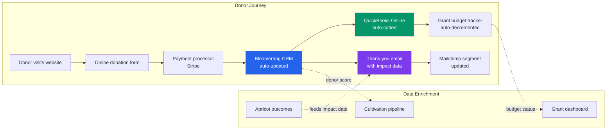

### Sequence Diagram: Donation End-to-End

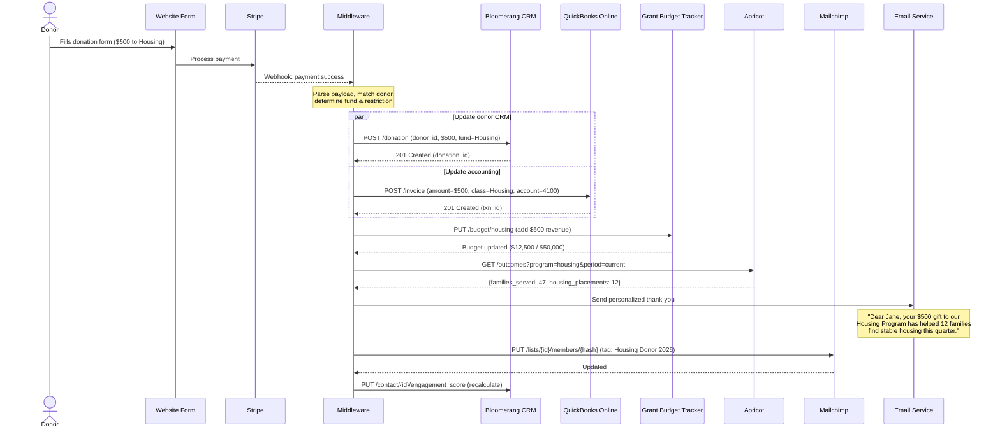

### What Changes

A donation that previously required a bookkeeper to manually enter it in QuickBooks, a development associate to log it in Bloomerang, and a program director to check if it counts toward a grant goal now flows through every system in under 30 seconds with zero manual intervention. The thank-you email includes real outcome data instead of generic language.

### Technical Implementation

- **Stripe Webhook** fires `payment_intent.succeeded` to the middleware endpoint.
- **Bloomerang REST API** (`POST /api/v2/transaction`) creates the donation record with fund designation.
- **QuickBooks Online API** (`POST /v3/company/{id}/invoice`) creates the revenue entry with correct class tracking and account code.
- **Apricot API** (`GET /api/v2/records`) pulls current program outcome metrics for the relevant program.
- **Mailchimp API** (`PATCH /3.0/lists/{id}/members/{hash}`) updates donor tags and segments.
- The middleware maps Stripe metadata fields (fund designation, campaign source) to the correct codes in each downstream system.

### Impact

Donor receives a personalized, outcome-rich thank-you within minutes instead of a generic letter weeks later. Finance has clean books from day one. Grant managers see real-time revenue against budget. Donor retention improves because donors feel their specific impact.

---

## 3. The Finance & Accounting Pipeline (Wired)

### Fixed Pipeline

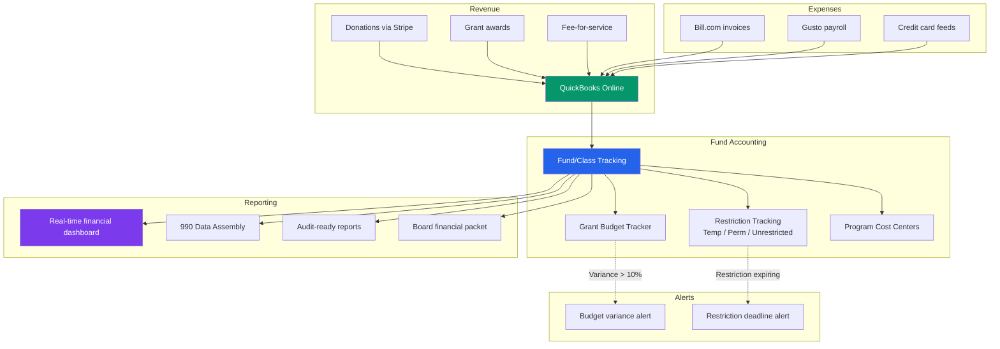

### Sequence Diagram: Grant Financial Lifecycle

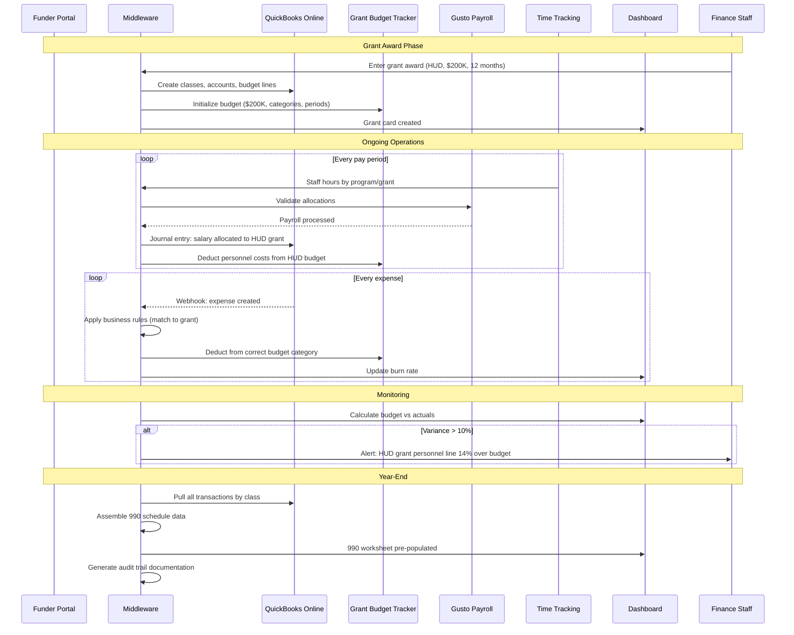

### What Changes

Fund accounting stops being a manual classification exercise. Every transaction is auto-coded to the correct fund, class, and grant at the point of entry. Budget-to-actuals is real-time instead of a monthly reconciliation marathon. The 990 is mostly pre-populated instead of a months-long assembly project.

### Technical Implementation

- **QuickBooks Online API** webhooks fire on every transaction creation or update. The middleware intercepts and validates correct class/fund coding.
- **Gusto API** (`GET /v1/companies/{id}/payrolls`) pulls payroll data after each run. The middleware applies time-tracking allocation percentages and creates split journal entries in QBO.
- **Time tracking integration** maps staff hours to grant cost centers. The middleware converts hours to dollar amounts using each employee's loaded rate.
- **Grant Budget Tracker** is a lightweight database table that the middleware updates on every financial event, comparing actuals against the budget loaded at grant inception.
- **990 Assembly** queries QBO by class and account to pre-populate Part VIII (Revenue), Part IX (Expenses), and Schedule A.

### Impact

Finance staff spend time analyzing data instead of entering and reconciling it. Grant budget overruns are caught in real time instead of discovered at reporting time. Audit prep drops from weeks to days because every transaction has a complete, automated trail.

---

## 4. The Program Delivery & Case Management Pipeline (Wired)

### Fixed Pipeline

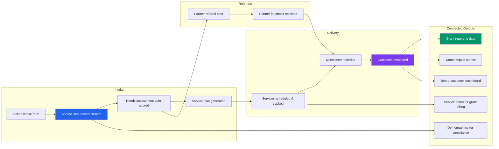

### Sequence Diagram: Client Journey End-to-End

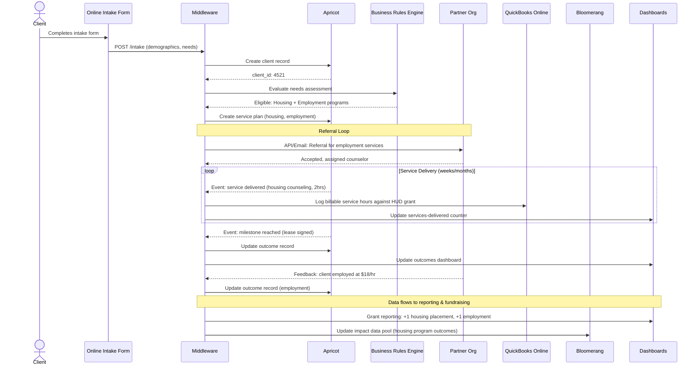

### What Changes

Client data entered once at intake propagates to every system that needs it. Service delivery is tracked in real time against grant deliverables. Outcomes from partner organizations feed back into the client record automatically instead of being lost. Program directors see a live dashboard instead of running reports monthly.

### Technical Implementation

- **Apricot API** (`POST /api/v2/records/{form_id}`) creates and updates client records. Webhooks or polling detects new service entries and milestone events.
- **Business Rules Engine** evaluates intake data against program eligibility criteria and grant-funded service slots.
- **Partner integrations** range from API connections (for tech-forward partners) to structured email parsing (for partners without APIs).
- **QBO integration** logs billable service units against the correct grant class for cost-reimbursement grants.
- **Bloomerang integration** aggregates anonymized outcome data into impact pools that feed donor communications.

### Impact

Case managers spend time with clients instead of with spreadsheets. Grant deliverables are tracked as services happen, not reconstructed at reporting time. Referral partners are no longer a black hole. The organization can prove its impact with real data.

---

## 5. The Grant Reporting Pipeline (Wired)

> This is the big one. The single most painful operational process at most nonprofits becomes largely automated.

### Fixed Pipeline

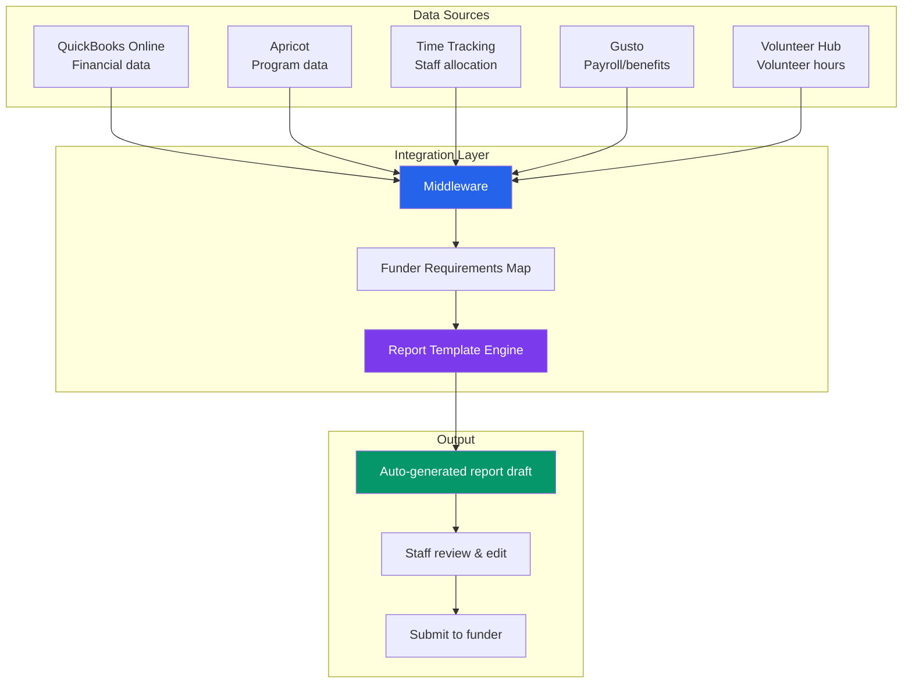

### Sequence Diagram: Automated Grant Report Assembly

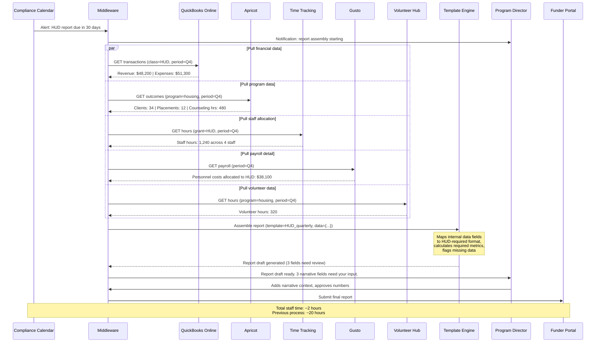

### Sequence Diagram: Multiple Funders in Parallel

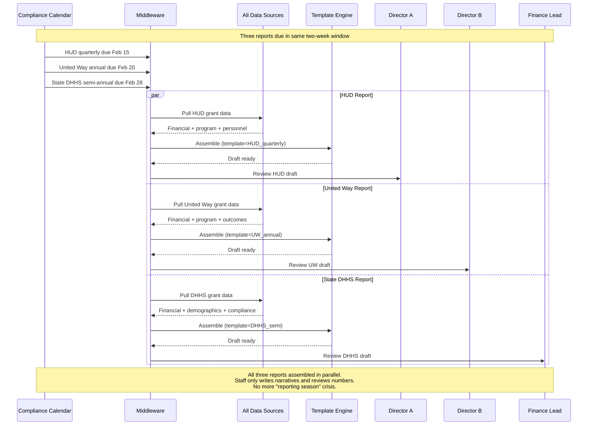

### What Changes

Grant reporting goes from a multi-week, all-hands crisis to a largely automated process where staff review and add narrative context to pre-assembled reports. Three reports due in the same window no longer means three weeks of overtime. The data is already in the systems; the middleware just pulls it together.

### Technical Implementation

- **Compliance Calendar** stores every grant's reporting schedule, required data fields, and template format.
- **Template Engine** maintains funder-specific report templates that map internal data fields to each funder's required format. For example, HUD requires specific demographic breakdowns that differ from United Way's outcome categories.
- **Data pull orchestration** runs parallel API queries to all source systems, caches results, and reconciles any discrepancies before assembly.
- **QBO API** (`GET /v3/company/{id}/reports/ProfitAndLoss?class=HUD`) pulls financial summaries.
- **Apricot API** queries pull program metrics filtered by grant-funded services.
- **Missing data detection** flags any required fields that could not be auto-populated, so staff know exactly where to focus their time.

### Impact

This single pipeline may represent the highest-value integration in the entire system. Grant reporting consumes enormous staff time, creates enormous stress, and the data already exists across systems. Automating the assembly frees dozens of hours per reporting cycle, reduces errors, and eliminates the risk of missed deadlines.

---

## 6. The Communications & Donor Engagement Pipeline (Wired)

### Fixed Pipeline

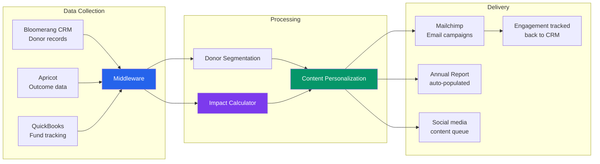

### Sequence Diagram: The Closed Feedback Loop

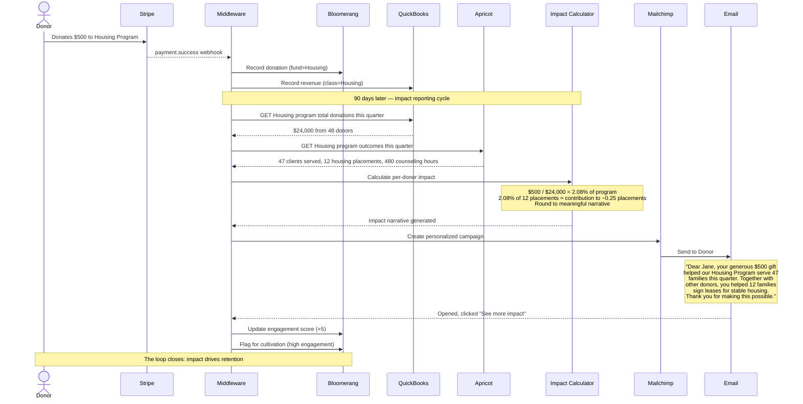

### What Changes

Donors currently receive generic thank-you letters with no connection to actual outcomes. The wired pipeline creates a closed feedback loop: donation flows in, outcomes are tracked, impact is calculated, and personalized communication flows back to the donor with real data about what their gift accomplished. Email engagement data flows back to the CRM to inform cultivation strategy.

### Technical Implementation

- **Impact Calculator** is a middleware service that correlates donation amounts with program outcomes. It uses fund/class tracking from QBO to determine what percentage of a program's budget each donor funded, then maps that to outcomes from Apricot.
- **Mailchimp API** (`POST /3.0/campaigns`) creates segmented campaigns with merge fields populated by the impact calculator.
- **Engagement tracking** uses Mailchimp webhook events (open, click, unsubscribe) to update donor records in Bloomerang via API.
- **Donor segmentation** uses giving history, engagement scores, and program affinity to create targeted communication streams.

### Impact

Donor retention is the single biggest lever in nonprofit fundraising economics. Moving retention from 45% to 55% can be worth more than any single new campaign. Personalized, outcome-driven communication is the proven way to do it, and this pipeline makes it automatic instead of aspirational.

---

## 7. The Volunteer Management Pipeline (Wired)

### Fixed Pipeline

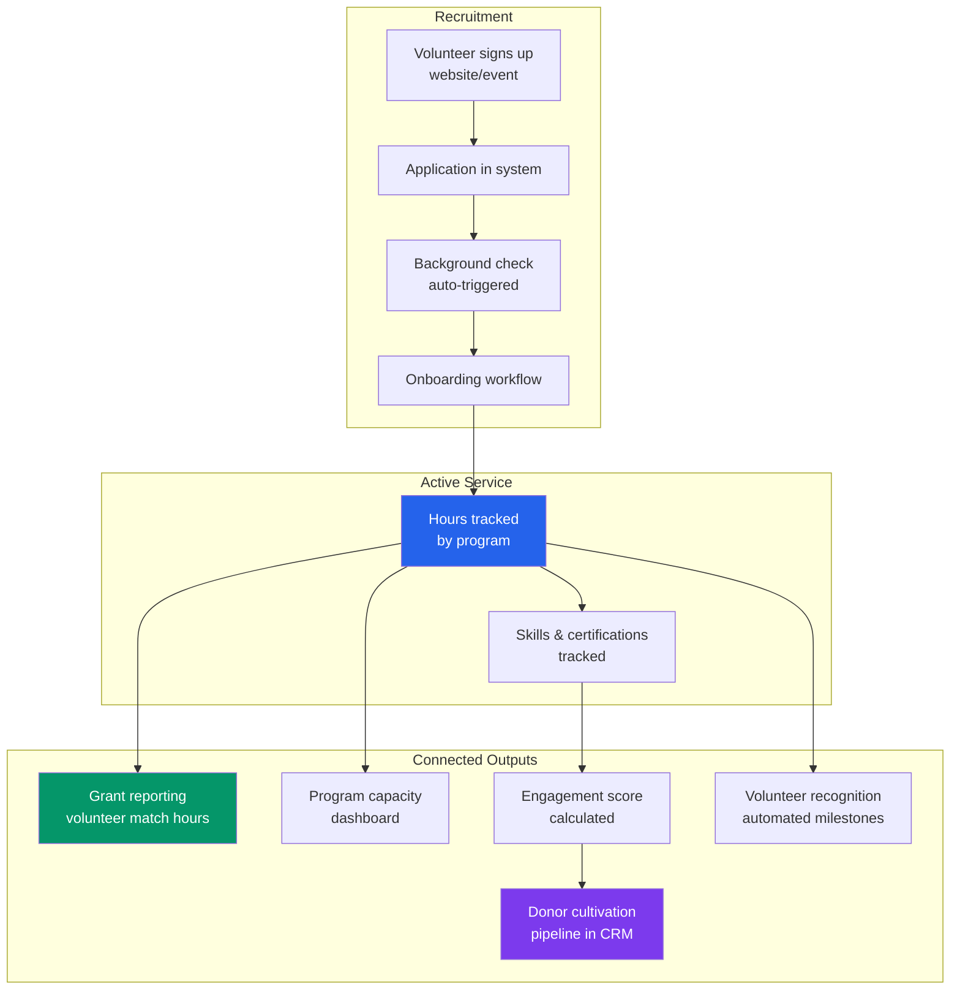

### Sequence Diagram: Volunteer-to-Donor Cultivation

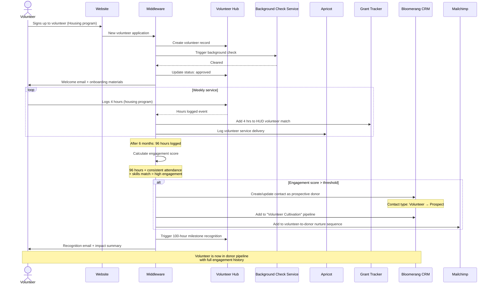

### What Changes

Volunteer hours currently sit in an isolated system, unreported against grants that allow volunteer match, and disconnected from donor cultivation. The wired pipeline tracks volunteer hours against grant requirements automatically, calculates engagement scores, and feeds high-engagement volunteers into the donor cultivation pipeline in Bloomerang.

### Technical Implementation

- **Volunteer Hub API** (or equivalent) captures hours and triggers events on logging.
- **Background check integration** uses API (e.g., Checkr, Sterling) to trigger and receive results automatically.
- **Grant match tracking** maps volunteer hours to grants that accept in-kind match, using the middleware to calculate the dollar-equivalent and update the grant budget tracker.
- **Bloomerang API** creates or merges contact records when volunteers cross engagement thresholds, preserving full volunteer history on the donor record.
- **Engagement scoring** uses hours logged, consistency, event attendance, and skill alignment to generate a numeric score.

### Impact

Volunteer match hours are a significant revenue source for many grants that goes under-reported because tracking is manual. Volunteers are also the highest-conversion donor prospects. This pipeline captures both values automatically.

---

## 8. The HR & Payroll Pipeline (Wired)

### Fixed Pipeline

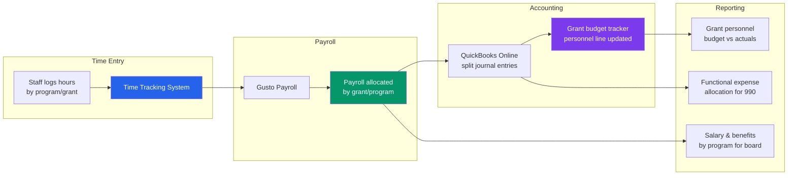

### Sequence Diagram: Time-to-Grant Allocation

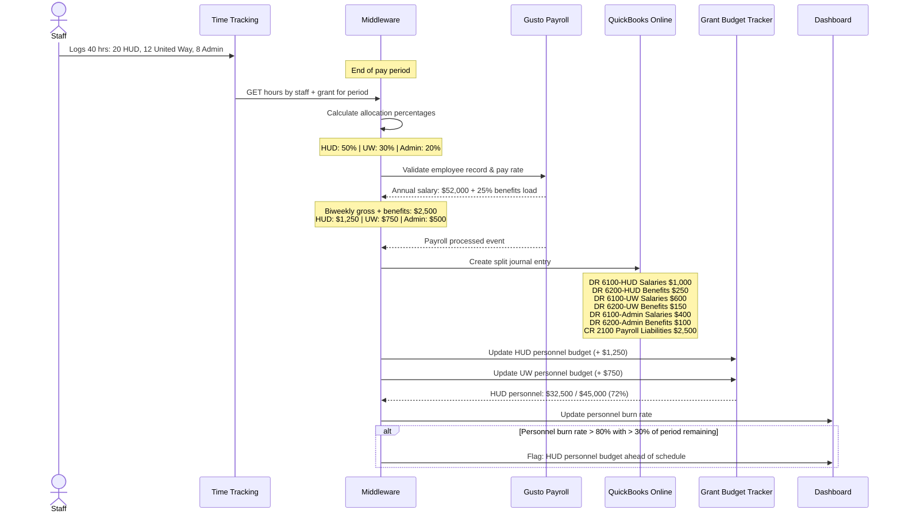

### What Changes

Staff time allocation currently lives in a spreadsheet that someone manually reconciles against payroll, then manually enters as journal entries in QuickBooks, then manually checks against grant budgets. The wired pipeline automates every step: time entries drive payroll allocation, payroll drives accounting entries, and accounting entries drive grant budget tracking.

### Technical Implementation

- **Time tracking** can be a lightweight tool (Harvest, Toggl, or even a custom form) that captures hours by grant/program code.
- **Gusto API** (`GET /v1/companies/{id}/payrolls/{payroll_id}`) pulls completed payroll data.
- **Middleware** applies time-based allocation percentages to actual payroll amounts (including benefits load) and creates the correctly split journal entries.
- **QBO API** (`POST /v3/company/{id}/journalentry`) creates multi-line journal entries with correct class coding per grant.
- **Grant Budget Tracker** receives the allocated amounts and recalculates burn rates.

### Impact

Personnel costs are typically 60-80% of a nonprofit's budget. Getting this allocation right is critical for grant compliance and financial reporting. Automating it eliminates the most error-prone manual process in nonprofit accounting and ensures personnel costs are tracked against grants in real time.

---

## 9. The Compliance & Reporting Pipeline (Wired)

### Fixed Pipeline

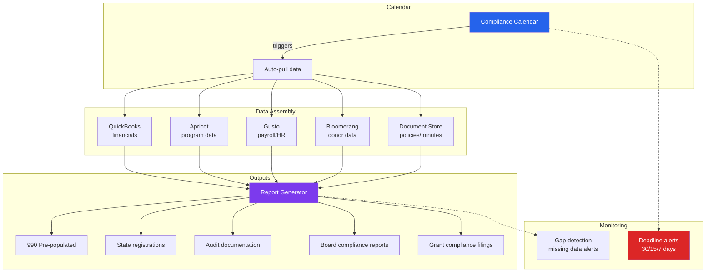

### Sequence Diagram: Annual Compliance Cycle

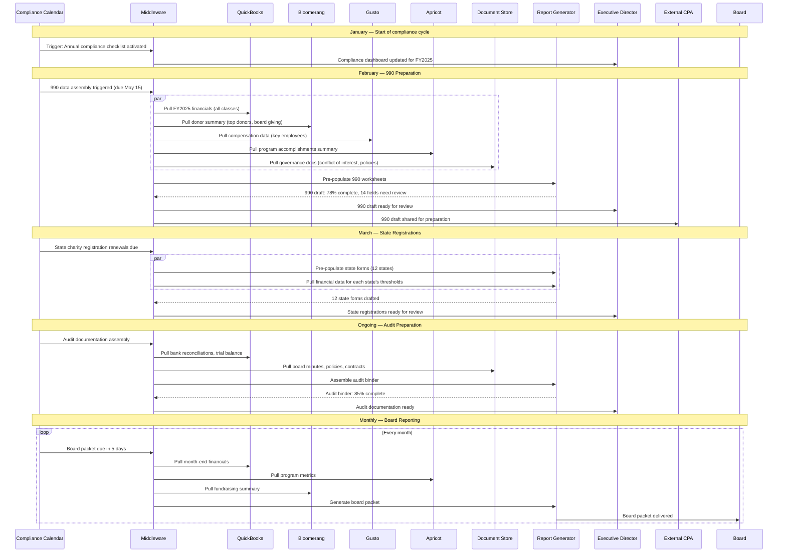

### What Changes

Compliance deadlines are currently tracked in someone's head or a basic spreadsheet. Data for each requirement is manually gathered from multiple systems. The wired pipeline maintains a comprehensive compliance calendar, auto-assembles data for each requirement, and alerts staff to gaps well before deadlines.

### Technical Implementation

- **Compliance Calendar** is a database of all recurring obligations: 990 filing, state registrations, grant reports, audit milestones, insurance renewals, and board governance requirements.
- **Trigger engine** fires at configurable lead times (90, 60, 30, 15, 7 days before deadlines).
- **990 Assembly** uses QBO API to pull Part VIII (revenue by source), Part IX (functional expenses), Schedule A (public support test), and Schedule B (contributor schedule from Bloomerang). Gusto API provides Part VII compensation data.
- **State registration** forms are pre-populated using financial data thresholds that determine filing requirements in each state.
- **Gap detection** compares required data fields against available data and alerts staff to anything that needs manual input.

### Impact

Compliance failures have existential consequences for nonprofits: loss of tax-exempt status, loss of state registration, funder clawbacks. The wired pipeline makes it nearly impossible to miss a deadline and dramatically reduces the cost of compliance by automating data assembly.

---

## 10. The Board Governance Pipeline (Wired)

### Fixed Pipeline

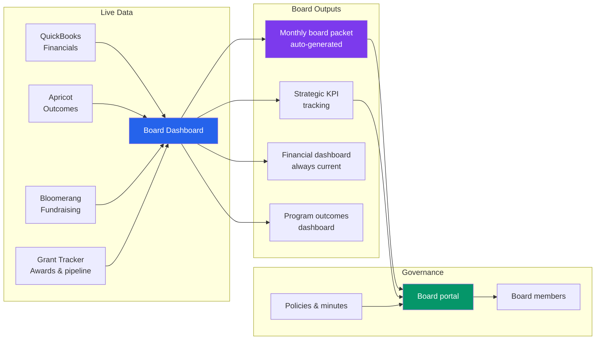

### Sequence Diagram: Board Packet Generation

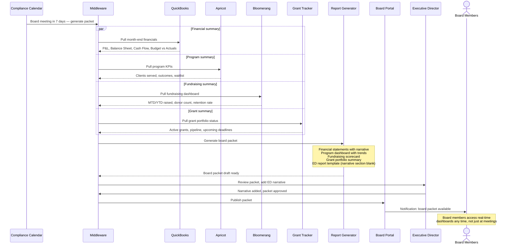

### What Changes

Board members currently receive a hastily assembled packet the night before meetings, if they receive one at all. Financial data is weeks old. Program data is anecdotal. The wired pipeline generates a comprehensive, data-driven board packet automatically, with the ED only needing to add narrative context. Between meetings, board members have access to real-time dashboards.

### Technical Implementation

- **Board Portal** can be a simple authenticated web application or a service like BoardEffect, Diligent, or even a shared Google Drive with structured folders.
- **Report Generator** uses templates that combine financial charts (from QBO data), program outcome visualizations (from Apricot data), and fundraising metrics (from Bloomerang data).
- **Real-time dashboards** are always-on views powered by the Unified Data Model, not generated on demand.
- **Strategic KPI tracking** compares actual metrics against board-approved annual goals and shows trend lines.

### Impact

Board members who are well-informed make better decisions and are more engaged. An engaged board fundraises more effectively, provides better oversight, and is less likely to be surprised by problems. The automated packet also frees the ED from spending days each month assembling reports.

---

## 11. The Unified Data Model

```mermaid
erDiagram
    CONTACT {
        uuid id PK
        string first_name
        string last_name
        string email
        string phone
        enum type "donor, volunteer, client, staff, board"
        boolean is_donor
        boolean is_volunteer
        boolean is_client
        boolean is_staff
        boolean is_board_member
        float engagement_score
        date created_at
    }

    TRANSACTION {
        uuid id PK
        uuid contact_id FK
        uuid funding_source_id FK
        enum type "donation, grant_revenue, expense, in_kind"
        decimal amount
        date transaction_date
        string payment_method
        enum restriction "unrestricted, temp_restricted, perm_restricted"
        string external_ref_qbo
        string external_ref_bloomerang
    }

    PROGRAM {
        uuid id PK
        string name
        string description
        enum status "active, inactive, planned"
        date start_date
        date end_date
    }

    SERVICE {
        uuid id PK
        uuid program_id FK
        uuid client_id FK
        uuid staff_id FK
        string service_type
        date service_date
        decimal hours
        text notes
    }

    OUTCOME {
        uuid id PK
        uuid program_id FK
        uuid client_id FK
        string outcome_type
        string outcome_value
        date measured_date
        uuid grant_id FK
    }

    FUNDING_SOURCE {
        uuid id PK
        string name
        enum type "individual, foundation, government, corporate, earned"
        enum restriction "unrestricted, temp_restricted, perm_restricted"
        decimal budget_amount
        date start_date
        date end_date
        uuid program_id FK
    }

    GRANT {
        uuid id PK
        uuid funding_source_id FK
        string funder_name
        string grant_number
        decimal award_amount
        date award_date
        date start_date
        date end_date
        enum status "prospect, submitted, awarded, active, closed"
    }

    GRANT_BUDGET_LINE {
        uuid id PK
        uuid grant_id FK
        string category
        decimal budgeted_amount
        decimal spent_amount
        decimal remaining_amount
    }

    GRANT_REPORT {
        uuid id PK
        uuid grant_id FK
        date due_date
        enum status "upcoming, in_progress, submitted, accepted"
        string template_id
    }

    VOLUNTEER_HOURS {
        uuid id PK
        uuid contact_id FK
        uuid program_id FK
        date date
        decimal hours
        string activity
    }

    TIME_ENTRY {
        uuid id PK
        uuid contact_id FK
        uuid program_id FK
        uuid grant_id FK
        date date
        decimal hours
    }

    COMPLIANCE_ITEM {
        uuid id PK
        string name
        enum type "990, state_registration, grant_report, audit, insurance"
        date due_date
        enum status "upcoming, in_progress, completed, overdue"
        integer alert_days_before
    }

    COMMUNICATION {
        uuid id PK
        uuid contact_id FK
        enum channel "email, mail, phone, event"
        date sent_date
        string campaign_id
        boolean opened
        boolean clicked
    }

    CONTACT ||--o{ TRANSACTION : "makes"
    CONTACT ||--o{ SERVICE : "receives as client"
    CONTACT ||--o{ SERVICE : "delivers as staff"
    CONTACT ||--o{ VOLUNTEER_HOURS : "logs"
    CONTACT ||--o{ TIME_ENTRY : "tracks"
    CONTACT ||--o{ COMMUNICATION : "receives"
    PROGRAM ||--o{ SERVICE : "contains"
    PROGRAM ||--o{ OUTCOME : "produces"
    PROGRAM ||--o{ VOLUNTEER_HOURS : "receives"
    FUNDING_SOURCE ||--o{ TRANSACTION : "funds"
    FUNDING_SOURCE ||--o{ GRANT : "originates"
    GRANT ||--o{ GRANT_BUDGET_LINE : "has"
    GRANT ||--o{ GRANT_REPORT : "requires"
    GRANT ||--o{ TIME_ENTRY : "tracks against"
    GRANT ||--o{ OUTCOME : "measures"
```

The critical insight in this data model is the **CONTACT** entity. In most nonprofits, the same person can be a donor, a volunteer, a client, and eventually a board member. Current systems store these as separate records in separate databases. The unified data model uses boolean flags and a single contact record so that a volunteer's hours, a donor's gifts, and a client's outcomes are all visible on one profile.

The **FUNDING_SOURCE** and **GRANT** entities create the connective tissue between money coming in (transactions), money going out (expenses), and what it accomplishes (outcomes). This three-way join — funding to spending to impact — is the relationship that breaks down when systems are disconnected.

---

## 12. The Integration Architecture

### Technical Architecture

```mermaid
graph TB
    subgraph External APIs
        BL_API[Bloomerang REST API<br/>v2]
        QBO_API[QuickBooks Online API<br/>v3]
        APR_API[Apricot API<br/>v2]
        MC_API[Mailchimp API<br/>v3.0]
        GUSTO_API[Gusto API<br/>v1]
        STRIPE_API[Stripe API<br/>Webhooks]
        VOL_API[Volunteer Hub API]
        BG_API[Background Check API<br/>Checkr]
    end

    subgraph Webhook Receivers
        WH1[POST /webhooks/stripe]
        WH2[POST /webhooks/qbo]
        WH3[POST /webhooks/mailchimp]
        WH4[POST /webhooks/gusto]
    end

    subgraph Message Queue
        Q[Redis / RabbitMQ]
        Q1[donation.received]
        Q2[expense.created]
        Q3[payroll.processed]
        Q4[service.delivered]
        Q5[outcome.recorded]
        Q6[hours.logged]
    end

    subgraph Middleware Services
        ROUTER[Event Router]
        TRANSFORM[Data Transformer]
        RULES[Business Rules Engine]
        CONFLICT[Conflict Resolver]
        RETRY[Error Handler<br/>Exponential Backoff]
        SCHEDULER[Job Scheduler<br/>Cron-based batch sync]
    end

    subgraph Data Layer
        DB[(PostgreSQL<br/>Unified Data Model)]
        CACHE[(Redis Cache<br/>API responses)]
        AUDIT[(Audit Log<br/>Every change tracked)]
    end

    subgraph Sync Engine
        REALTIME[Real-time sync<br/>webhooks → immediate]
        BATCH[Batch sync<br/>every 15 min / hourly / daily]
        RECONCILE[Reconciliation<br/>nightly full-table compare]
    end

    subgraph Reporting Layer
        DASH1[Executive Dashboard]
        DASH2[Grant Dashboard]
        DASH3[Board Portal]
        RPT[Report Generator]
        EXPORT[Data Export<br/>CSV / PDF / API]
    end

    STRIPE_API --> WH1
    QBO_API --> WH2
    MC_API --> WH3
    GUSTO_API --> WH4

    WH1 --> Q
    WH2 --> Q
    WH3 --> Q
    WH4 --> Q

    Q --> ROUTER
    ROUTER --> TRANSFORM
    TRANSFORM --> RULES
    RULES --> CONFLICT
    CONFLICT --> DB
    RULES --> RETRY

    RETRY --> Q

    SCHEDULER --> BATCH
    BATCH --> BL_API
    BATCH --> APR_API
    BATCH --> VOL_API

    RECONCILE --> DB

    DB --> DASH1
    DB --> DASH2
    DB --> DASH3
    DB --> RPT
    DB --> EXPORT

    ROUTER -.-> AUDIT
    TRANSFORM -.-> AUDIT
    RULES -.-> AUDIT
    CONFLICT -.-> AUDIT

    style Q fill:#dc2626,color:#fff
    style DB fill:#2563eb,color:#fff
    style RULES fill:#7c3aed,color:#fff
    style ROUTER fill:#059669,color:#fff
```

### Sync Strategy by System

| System | Sync Method | Direction | Frequency | Notes |
|--------|------------|-----------|-----------|-------|
| Stripe | Webhooks | Inbound | Real-time | Payment events trigger immediate processing |
| QuickBooks Online | Webhooks + Batch | Bidirectional | Real-time + hourly reconciliation | Webhooks for new transactions; batch for reconciliation |
| Bloomerang | REST API polling | Bidirectional | Every 15 minutes | No webhooks available; poll for changes |
| Apricot | REST API polling | Bidirectional | Every 15 minutes | Poll for new records and updates |
| Mailchimp | Webhooks + Batch | Bidirectional | Real-time events + daily list sync | Webhook for engagement; batch for list management |
| Gusto | Webhooks + Batch | Inbound | Per payroll cycle + monthly reconciliation | Payroll data flows in; no write-back needed |
| Volunteer Hub | REST API polling | Inbound | Every 30 minutes | Pull hours and new registrations |

### Error Handling Strategy

```mermaid
graph TD
    A[API Call Fails] --> B{Error Type?}
    B -->|Rate Limited| C[Backoff: 1s → 2s → 4s → 8s]
    B -->|Auth Failed| D[Refresh token, retry once]
    B -->|Server Error 5xx| E[Retry 3x with backoff]
    B -->|Client Error 4xx| F[Log error, alert staff]
    B -->|Timeout| G[Retry 2x, then queue for batch]

    C --> H{Succeeded?}
    D --> H
    E --> H
    G --> H

    H -->|Yes| I[Process normally]
    H -->|No| J[Dead letter queue]
    J --> K[Staff alert: manual intervention needed]
    K --> L[Dashboard shows failed syncs]

    F --> L

    style J fill:#dc2626,color:#fff
    style I fill:#059669,color:#fff
```

### Conflict Resolution

When the same record is modified in two systems between sync cycles, the middleware applies these rules in order:

1. **Timestamp wins** — most recent update takes precedence for non-financial data.
2. **Source of truth wins** — each data type has a designated source of truth (Bloomerang for donor data, QBO for financial data, Apricot for client data). The source of truth always wins for its owned fields.
3. **Financial data never auto-resolves** — any conflict in financial amounts is flagged for human review.
4. **Audit everything** — both versions are logged in the audit trail regardless of resolution.

---

## 13. The Wiring Map (Before / After)

### Before: Disconnected Systems

```mermaid
graph TB
    BL[Bloomerang<br/>Donor CRM]
    QBO[QuickBooks Online<br/>Accounting]
    APR[Apricot<br/>Case Management]
    MC[Mailchimp<br/>Email Marketing]
    GUSTO[Gusto<br/>Payroll & HR]
    VOL[Volunteer Hub<br/>Volunteer Mgmt]
    STRIPE[Stripe<br/>Payment Processing]
    EXCEL1[Excel<br/>Grant Tracking]
    EXCEL2[Excel<br/>Board Reports]
    EXCEL3[Excel<br/>Time Allocation]
    EXCEL4[Excel<br/>Compliance Calendar]
    GDRIVE[Google Drive<br/>Document Storage]

    BL ~~~ QBO
    QBO ~~~ APR
    APR ~~~ MC
    MC ~~~ GUSTO
    GUSTO ~~~ VOL
    VOL ~~~ STRIPE
    STRIPE ~~~ EXCEL1
    EXCEL1 ~~~ EXCEL2
    EXCEL2 ~~~ EXCEL3
    EXCEL3 ~~~ EXCEL4
    EXCEL4 ~~~ GDRIVE

    style BL fill:#9ca3af,color:#000
    style QBO fill:#9ca3af,color:#000
    style APR fill:#9ca3af,color:#000
    style MC fill:#9ca3af,color:#000
    style GUSTO fill:#9ca3af,color:#000
    style VOL fill:#9ca3af,color:#000
    style STRIPE fill:#9ca3af,color:#000
    style EXCEL1 fill:#fbbf24,color:#000
    style EXCEL2 fill:#fbbf24,color:#000
    style EXCEL3 fill:#fbbf24,color:#000
    style EXCEL4 fill:#fbbf24,color:#000
    style GDRIVE fill:#9ca3af,color:#000
```

> Every system is an island. Staff are the integration layer. Spreadsheets fill the gaps. Data is re-entered, copy-pasted, and manually reconciled.

### After: Wired Through the Integration Layer

```mermaid
graph TB
    subgraph Core["Integration Layer"]
        MW[Middleware<br/>API Hub + Sync Engine<br/>+ Rules Engine]
        DB[(Unified Data Model<br/>PostgreSQL)]
        MW <--> DB
    end

    BL[Bloomerang<br/>Donor CRM] <-->|REST API<br/>15-min sync| MW
    QBO[QuickBooks Online<br/>Accounting] <-->|Webhooks +<br/>hourly reconcile| MW
    APR[Apricot<br/>Case Management] <-->|REST API<br/>15-min sync| MW
    MC[Mailchimp<br/>Email Marketing] <-->|Webhooks +<br/>daily sync| MW
    GUSTO[Gusto<br/>Payroll & HR] -->|Webhooks<br/>per pay cycle| MW
    VOL[Volunteer Hub] -->|REST API<br/>30-min sync| MW
    STRIPE[Stripe<br/>Payments] -->|Webhooks<br/>real-time| MW

    MW --> DASH[Dashboards<br/>Executive, Board,<br/>Grant, Program]
    MW --> RPT[Report Generator<br/>990, Grants, Board<br/>Packets, Compliance]
    MW --> ALERTS[Alerts Engine<br/>Deadlines, Variances,<br/>Compliance Gaps]

    style MW fill:#2563eb,color:#fff
    style DB fill:#7c3aed,color:#fff
    style DASH fill:#059669,color:#fff
    style RPT fill:#059669,color:#fff
    style ALERTS fill:#dc2626,color:#fff
    style BL fill:#3b82f6,color:#fff
    style QBO fill:#3b82f6,color:#fff
    style APR fill:#3b82f6,color:#fff
    style MC fill:#3b82f6,color:#fff
    style GUSTO fill:#3b82f6,color:#fff
    style VOL fill:#3b82f6,color:#fff
    style STRIPE fill:#3b82f6,color:#fff
```

### Connections Made

| Connection | What Flows | Impact |
|-----------|-----------|--------|
| Stripe → Bloomerang | Donation records, donor matching | No manual entry of online gifts |
| Stripe → QuickBooks | Revenue entries with fund coding | No manual journal entries for donations |
| Bloomerang → Mailchimp | Donor segments, engagement tags | Targeted communications without list exports |
| Apricot → Grant Tracker | Outcome metrics, service counts | Grant reports auto-populated with program data |
| Gusto → QuickBooks | Payroll with grant/program allocation | No manual split journal entries |
| Time Tracking → Gusto/QBO | Staff allocation percentages | Personnel costs auto-allocated to grants |
| Volunteer Hub → Grant Tracker | Volunteer match hours | In-kind match captured for grant compliance |
| QuickBooks → Board Dashboard | Real-time financial data | Board sees current numbers, not stale reports |
| Apricot → Bloomerang | Anonymized outcome data | Donor communications include real impact data |
| Compliance Calendar → All Systems | Data pull triggers | Reports auto-assembled before deadlines |
| All Systems → Audit Log | Every data change | Audit trail maintained automatically |

### What Gets Eliminated

| Eliminated | Replaced By |
|-----------|-------------|
| Excel grant tracking spreadsheet | Real-time grant budget dashboard fed by QBO + time tracking |
| Excel board report assembly | Auto-generated board packet from live data |
| Excel time allocation spreadsheet | Time tracking system integrated with payroll and grants |
| Excel compliance calendar | Database-driven compliance calendar with auto-alerts |
| Manual data re-entry across systems | Automated API sync between all systems |
| Monthly reconciliation marathons | Real-time data sync with nightly reconciliation |
| Multi-week grant report assembly | Auto-assembled report drafts from connected systems |
| Generic donor thank-you letters | Personalized impact communications with real outcome data |
| Staff serving as the integration layer | Middleware serving as the integration layer |

---

## Summary

The entire solution rests on one principle: **the data already exists**. Donations are already tracked in Bloomerang. Expenses are already in QuickBooks. Client outcomes are already in Apricot. Staff hours are already logged somewhere. The problem was never missing data — it was missing connections.

The integration layer creates those connections. It does not replace any existing tool. It does not require staff to learn new systems. It sits between everything, moves data where it needs to go, and produces the reports, dashboards, and communications that currently require dozens of hours of manual effort.

The result is an organization that knows its financial position in real time, can prove its impact with data, and spends its staff time on mission work instead of data entry.

> **Next: Doc 3 of 3** — "The Roadmap: How to Get From Here to There" — Phased implementation plan, priority sequencing, build-vs-buy decisions, and the business case for the integration investment.
"}}],"stop_reason":null,"stop_sequence":null,"usage":{"input_tokens":1,"cache_creation_input_tokens":166,"cache_read_input_tokens":10444,"cache_creation":{"ephemeral_5m_input_tokens":0,"ephemeral_1h_input_tokens":166},"output_tokens":25,"service_tier":"standard"}},"requestId":"req_011CXjydTj8wRHB1btWYDBCY","type":"assistant","uuid":"e555250f-ee7a-46a5-a038-52392ec6e3db","timestamp":"2026-02-02T21:52:10.584Z"}
{"parentUuid":"e555250f-ee7a-46a5-a038-52392ec6e3db","isSidechain":true,"userType":"external","cwd":"/Users/dev/Desktop/non-prof","sessionId":"f0de89b8-d87d-40d5-abe6-c82c13d33095","version":"2.1.29","gitBranch":"","agentId":"a6a6af7","slug":"parsed-herding-bird","type":"user","message":{"role":"user","content":[{"type":"tool_result","content":"