# Doc 3 of 3: The Sugar on Top — AI/ML, Templates, and Magic

> **Purpose:** This document describes every AI/ML-powered feature, template, automation, and innovative capability that can be layered ON TOP of the wired integration layer defined in Doc 2. These are the features that make nonprofit staff say "holy shit" — the things that feel like magic.
>
> **Prerequisite:** The unified data model and integration pipelines from Doc 2 must exist. AI without clean, connected data is just a hallucination engine.

---

## 1. Overview: The AI Layer

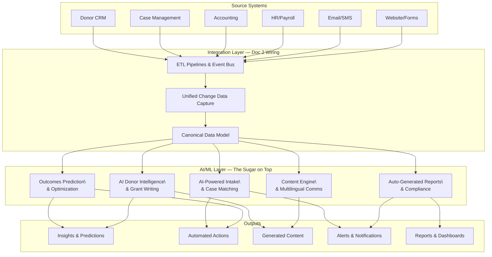

The AI layer is not a standalone product. It is a set of capabilities that consume clean, connected data from the integration layer and produce three categories of output:

1. **Insights** — predictions, scores, risk flags, recommendations
2. **Automations** — actions triggered without human initiation (routing, notifications, form population)
3. **Content** — generated text, reports, communications, translations

Every AI feature described below follows the same pattern: data in from the canonical model, intelligence applied, actionable output delivered to staff or clients.

---

## INTAKE & CLIENT SERVICES

---

## 2. AI-Powered Intake Forms

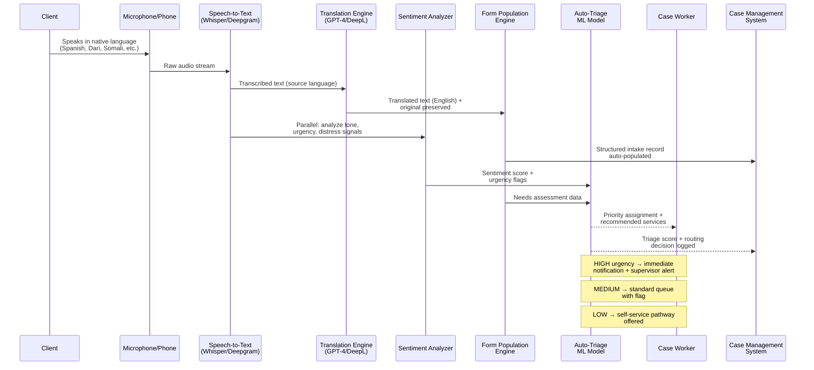

### What It Does

A client walks into an office, calls a hotline, or opens a web form. Instead of struggling through a paper form in a language they may not read fluently, they speak. The system:

- **Transcribes** speech to text in real time using Whisper or Deepgram
- **Translates** to English (preserving the original for the record)
- **Populates** structured intake fields automatically — name, address, household size, needs, etc.
- **Analyzes sentiment** to detect distress, urgency, or crisis signals
- **Auto-triages** based on needs assessment responses: housing emergency gets routed to the rapid rehousing team, food insecurity gets routed to the pantry coordinator, etc.
- **Notifies** the appropriate case worker with a priority score and recommended service plan

### Why It Matters

Intake is the bottleneck for every human services nonprofit. A single intake can take 45-90 minutes with paper forms and manual data entry. Language barriers make it worse — staff either need interpreters (expensive, scheduling delays) or clients struggle through English forms (incomplete data, missed needs).

- **Time savings:** 45-minute intake reduced to 15 minutes
- **Data quality:** Structured extraction catches information that free-text misses
- **Equity:** Clients served in their language from the first interaction
- **Urgency detection:** Suicidal ideation, domestic violence, homelessness crisis flagged immediately instead of discovered days later during case review

### Technical Stack

| Component | Technology |
|---|---|
| Speech-to-text | OpenAI Whisper API, Deepgram, or Google Speech-to-Text |
| Translation | GPT-4 API or DeepL API |
| Sentiment analysis | Fine-tuned classifier on crisis/distress indicators |
| Form population | LLM with structured output (JSON mode) mapped to intake schema |
| Auto-triage | Gradient-boosted classifier trained on historical intake-to-outcome data |
| Notifications | Integration layer event bus (Doc 2) |

---

## 3. Intelligent Case Matching & Routing

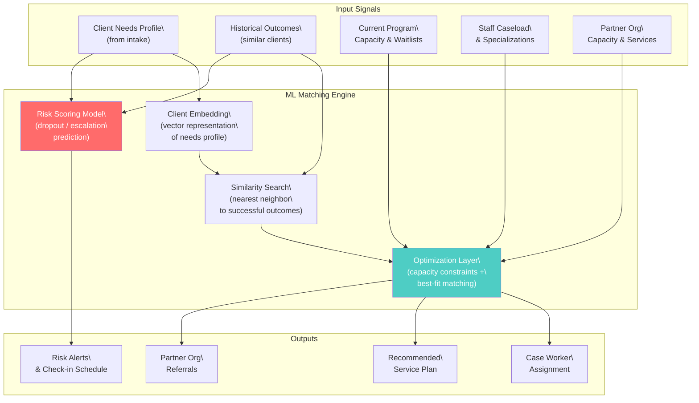

### What It Does

When a new client enters the system, the ML matching engine:

- **Embeds** the client's needs profile into a vector representation
- **Searches** historical data for similar clients who had successful outcomes — what services worked for people like this?
- **Scores risk** — based on demographic signals, needs complexity, and historical patterns, how likely is this client to drop off services or need escalation?
- **Optimizes** the match against current capacity constraints — which case worker has bandwidth, the right specialization, and the best track record with similar clients?
- **Generates referrals** to partner organizations when the client's needs exceed in-house capacity, factoring in partner waitlists and success rates

### Why It Matters

Most nonprofits assign cases based on who has the lightest caseload or round-robin. This ignores the reality that case worker specialization and client-worker fit dramatically affect outcomes. A case worker who specializes in veterans' housing should not be assigned a refugee family's education case just because they have an open slot.

- **Outcome improvement:** Matching clients to the right services and workers based on evidence, not convenience
- **Dropout reduction:** Predictive risk scoring enables proactive check-ins before a client disengages (catching them at week 2, not discovering they vanished at week 8)
- **Network utilization:** Smart referrals ensure partner orgs are used effectively, not just the ones staff happen to remember
- **Staff retention:** Case workers get cases that match their skills, reducing burnout from mismatched assignments

### Technical Stack

| Component | Technology |
|---|---|
| Client embedding | Sentence transformers or OpenAI embedding API |
| Similarity search | Vector DB (Pinecone, Weaviate, or pgvector) |
| Risk scoring | XGBoost or LightGBM trained on historical outcomes |
| Optimization | Constraint satisfaction solver (OR-Tools or custom) |
| Partner matching | API integration with 211/Aunt Bertha + internal partner DB |

---

## 4. Benefits Eligibility Screening (LLM-Powered)

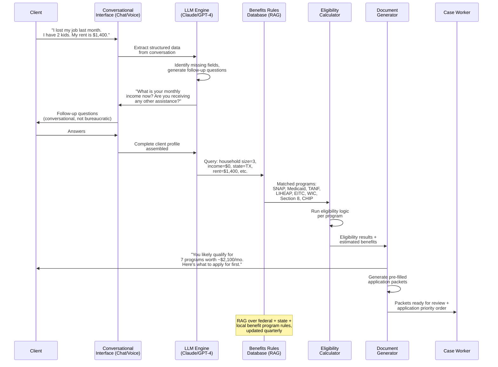

### What It Does

This is the single highest-impact AI feature for human services nonprofits. Instead of a case worker manually checking 50+ benefit programs against a client's situation (a process that takes 2-4 hours per client and requires deep expertise), the system:

- **Conducts a conversational assessment** — the client answers plain-language questions (via chat, voice, or in-person with a worker). No bureaucratic jargon.
- **Extracts structured data** — the LLM converts conversational answers into the data fields needed for eligibility determination (household size, income, assets, citizenship status, disability status, etc.)
- **Queries the benefits rules database** — a RAG-powered knowledge base containing federal, state, and local benefit program rules, income thresholds, categorical eligibility criteria, and application procedures
- **Runs eligibility calculations** — deterministic rules engine (not LLM guessing) that checks each program's actual criteria
- **Generates a personalized eligibility report** — "You likely qualify for SNAP ($450/mo), Medicaid (family coverage), LIHEAP ($600 annual heating assistance), TANF ($320/mo), and EITC ($3,200 refund)"
- **Pre-fills application packets** — pulls client data into each program's application forms, ready for review and submission

### Why It Matters

This is the "Benefits in Action" play. The numbers are staggering:

- The average eligible family misses $3,000-5,000/year in benefits they qualify for because they do not know the programs exist or cannot navigate the applications
- A benefits screening that takes a trained specialist 2-4 hours takes this system 15 minutes
- An org with 10 case workers screening 5 clients/week goes from 200-400 hours/week on screening to 25 hours/week — **freeing 175-375 hours for actual case work**
- Each client who successfully enrolls in benefits they were missing represents $3,000-5,000/year in household stabilization — that is program impact the org can report to funders

This feature alone justifies the entire platform for human services organizations.

### Technical Stack

| Component | Technology |
|---|---|
| Conversational interface | Claude API or GPT-4 with structured output |
| Benefits rules DB | Vector DB + structured rules engine (RAG architecture) |
| Rules source | Benefits.gov API, state DHS APIs, manually curated local programs |
| Eligibility calculator | Deterministic rules engine (NOT LLM — accuracy is non-negotiable) |
| Document generation | Templated PDF generation with merge fields (PDFKit, Puppeteer) |
| Updates | Quarterly refresh from policy sources + manual review |

---

## FUNDRAISING & DONOR ENGAGEMENT

---

## 5. AI Donor Intelligence

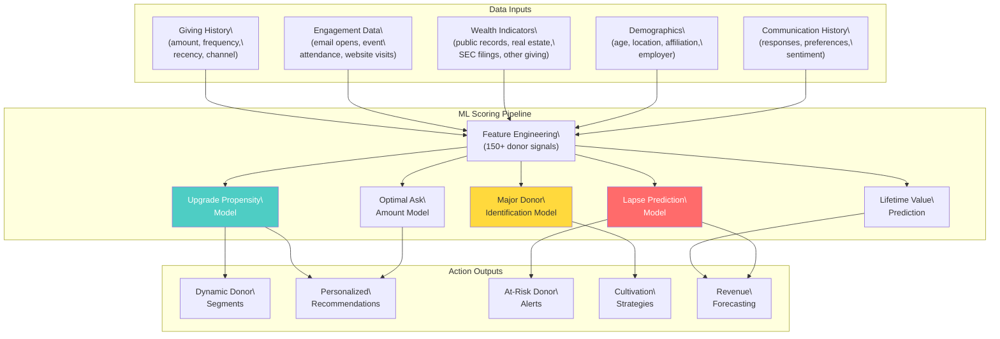

### What It Does

The AI Donor Intelligence system builds a comprehensive predictive profile for every donor in the CRM:

- **Upgrade propensity:** Which donors are ready to give more? The model identifies donors whose engagement is increasing, who attend events, who open emails, who gave more this year than last — and scores their likelihood of upgrading to the next giving level.
- **Lapse prediction:** Which donors are about to disappear? The sector average retention rate is 46% — meaning more than half of donors do not give again. The model detects disengagement signals (fewer opens, longer gaps between gifts, reduced amounts) weeks before the donor lapses, giving fundraisers time to intervene.
- **Major donor identification:** Which mid-level donors have major donor potential? Combines wealth screening data with engagement patterns to surface donors who have capacity AND affinity but have never been asked for a major gift.
- **Optimal ask amount:** What should we ask for? Too high and the donor feels pressured. Too low and you leave money on the table. The model suggests an amount based on giving history, wealth indicators, and what similar donors gave.
- **Lifetime value prediction:** What is this donor worth over 5-10 years? Enables strategic investment in cultivation.

### Why It Matters

Fundraising is the lifeblood of every nonprofit, and most orgs are flying blind. They send the same appeal to every donor, ask for the same amount, and discover donors have lapsed months after the fact.

- **Revenue impact:** Even a 5% improvement in retention (46% to 51%) on a $1M donor base = $50K additional annual revenue
- **Major donor pipeline:** Identifying 10 mid-level donors with major donor potential = potential $50K-500K in upgraded giving
- **Efficiency:** Fundraisers spend time on the right donors instead of spray-and-pray
- **The 46% problem:** The sector's retention crisis is the single biggest revenue leak. Predictive lapse detection directly addresses it.

### Technical Stack

| Component | Technology |
|---|---|
| Feature engineering | Python (pandas, feature-engine) on integrated donor data |
| Scoring models | XGBoost / LightGBM trained on historical giving patterns |
| Wealth screening | DonorSearch, iWave, or WealthEngine API |
| Segmentation | K-means clustering on donor behavior vectors |
| Recommendations | Rule-based engine on top of ML scores |
| Delivery | Dashboard in CRM + automated alerts via integration layer |

---

## 6. Personalized Impact Reports (Auto-Generated)

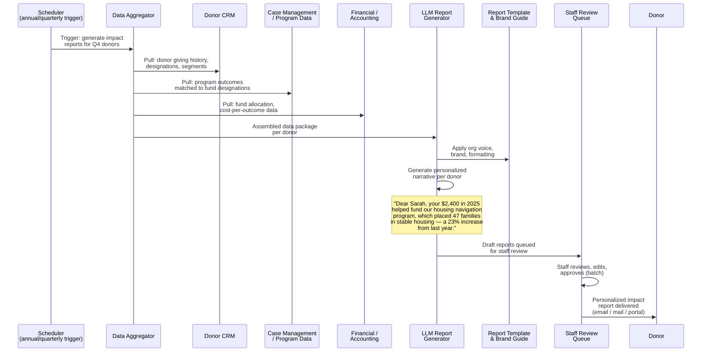

### What It Does

For each donor (or donor segment), the system:

- **Pulls giving history** — what did this donor give, when, and to what fund/program?
- **Pulls program outcomes** — what did that fund/program actually accomplish? How many clients served, housed, employed, graduated?
- **Calculates the donor's "share"** — if Sarah gave $2,400 to a $100,000 housing program that placed 47 families, her contribution represents ~2.4% of the outcomes
- **Generates a personalized narrative** — using the org's voice and brand guidelines, the LLM writes a compelling impact story that connects the donor's specific gift to real outcomes
- **Queues for review** — staff can review, edit, and approve in batch rather than writing each one from scratch
- **Delivers** via the donor's preferred channel (email, print, donor portal)

### Why It Matters

Donors who feel connected to impact renew at 2-3x the rate of donors who receive generic thank-yous. But personalized impact reports are labor-intensive — most orgs only create them for major donors ($5K+), leaving 95% of donors with a generic annual report.

- **Retention impact:** Personalized impact reporting can move retention from 46% to 60%+ for the segments that receive it
- **Scalability:** What used to be possible only for top 50 donors is now possible for every single donor
- **Time savings:** Writing 500 personalized impact reports manually = 500 hours. With AI generation + staff review = 25 hours.
- **Upgrade driver:** Donors who see their impact are more likely to increase giving

### Technical Stack

| Component | Technology |
|---|---|
| Data aggregation | Integration layer queries across CRM + case management + accounting |
| LLM generation | Claude API or GPT-4 with few-shot examples of org's writing style |
| Brand/voice guide | System prompt with org's tone, terminology, and formatting rules |
| Template engine | HTML/PDF template with dynamic content blocks |
| Delivery | Email via SendGrid/Mailchimp, print via Lob API, portal via web app |

---

## 7. AI Grant Writing Assistant

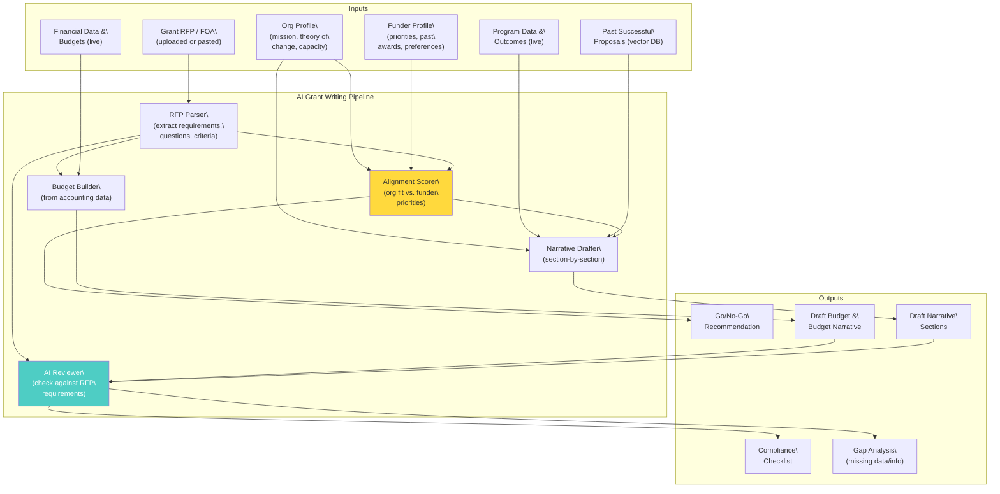

### What It Does

The grant writing assistant does NOT replace grant writers. It gives them superpowers:

1. **RFP parsing** — upload or paste the RFP and the system extracts every question, requirement, page limit, formatting rule, and evaluation criterion
2. **Go/no-go recommendation** — scores alignment between the funder's priorities and your org's strengths, past awards, and capacity. "This funder has awarded 80% of grants to orgs with budgets under $2M and focuses on workforce development — strong fit."
3. **Narrative drafting** — generates first drafts of each narrative section, pulling real data from program outcomes, client demographics, and org history. Uses RAG over past successful proposals to match the org's grant writing voice.
4. **Budget building** — auto-populates budget templates from accounting data. Staff allocation, fringe rates, indirect costs, program expenses — all pulled from live financial data instead of manually assembled.
5. **Compliance review** — checks the draft against every RFP requirement. "Section 3 requires a logic model — not yet included. Page limit for narrative is 10 pages — current draft is 12.3 pages. Budget requires cost-sharing documentation — not attached."

### Why It Matters

Grant writing is the highest-value, most time-consuming task in nonprofit operations. A single federal grant proposal can take 80-200 hours. Foundation proposals take 20-40 hours.

- **Time savings:** First draft in hours instead of weeks. Total proposal time reduced 40-60%.
- **Quality improvement:** Real data in every proposal instead of stale numbers copied from last year's application
- **Win rate:** Proposals with current, specific outcome data win at higher rates
- **Volume:** Org can pursue more grants with the same staff capacity
- **Budget accuracy:** Budgets built from actual financial data instead of estimates

### Technical Stack

| Component | Technology |
|---|---|
| RFP parsing | Claude API or GPT-4 with structured extraction |
| Past proposal DB | Vector DB (Pinecone/Weaviate) with embeddings of successful proposals |
| Narrative generation | LLM with RAG over proposals + live program data |
| Budget builder | Template engine + accounting API integration |
| Funder research | GrantStation API, Foundation Directory Online, Candid API |
| Compliance checker | Rule-based engine from parsed RFP requirements |

---

## 8. Smart Fundraising Campaigns

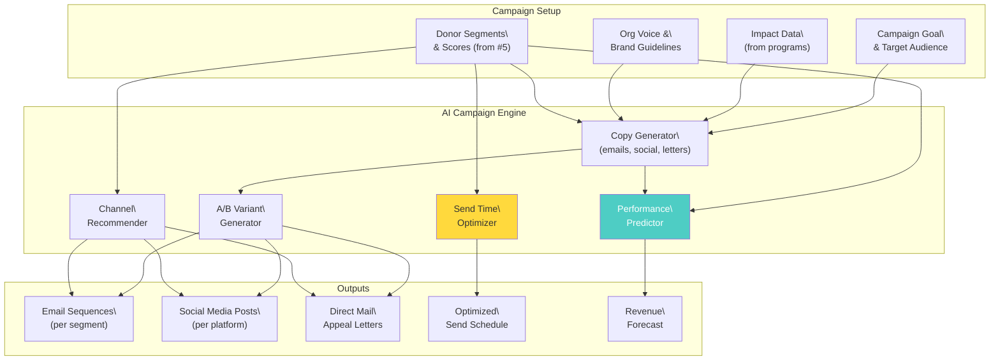

### What It Does

- **Generates campaign copy** across channels (email, social, direct mail) using real impact data and the org's established voice
- **Creates A/B variants** — multiple subject lines, opening hooks, and CTAs for testing
- **Optimizes send timing** per donor based on their historical engagement patterns (Sarah opens emails at 7am Tuesday; Michael opens at 9pm Thursday)
- **Predicts campaign performance** before launch — estimated open rate, click rate, conversion rate, and revenue based on segment composition and historical benchmarks
- **Recommends channels** per donor — some donors respond to email, others to mail, others to text

### Why It Matters

Most nonprofit fundraising campaigns are one-size-fits-all. Same email to every donor, same time, same ask. The data exists to personalize, but staff do not have time to write 15 variants and analyze optimal send times.

- **Revenue lift:** Personalized campaigns outperform generic ones by 20-40%
- **Time savings:** Campaign creation from 2 weeks to 2 days
- **Testing culture:** Easy A/B variant generation means orgs actually test instead of guessing
- **Donor experience:** Every donor gets the right message, at the right time, through the right channel

### Technical Stack

| Component | Technology |
|---|---|
| Copy generation | Claude API or GPT-4 with brand voice fine-tuning |
| A/B generation | LLM with variation prompts |
| Send time optimization | Statistical model on historical engagement data |
| Performance prediction | Regression model trained on past campaign results |
| Channel recommendation | Classification model on donor response history |
| Delivery | Integration with Mailchimp, Constant Contact, or SendGrid |

---

## OPERATIONS & REPORTING

---

## 9. Auto-Generated Grant Reports

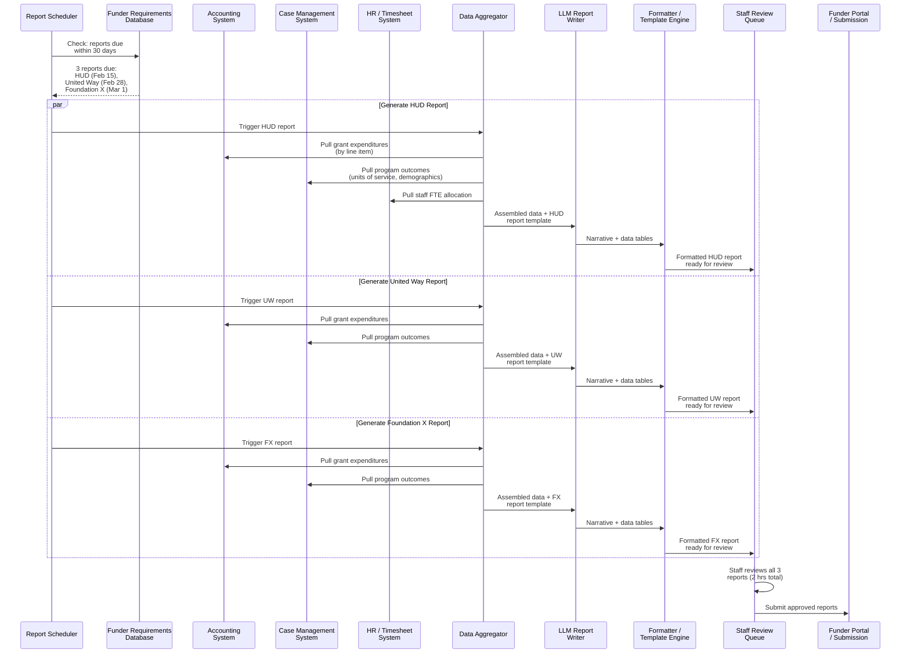

### What It Does

For every active grant, the system:

- **Knows the funder's reporting template** — what format, what metrics, what narrative questions, what financial detail level
- **Knows the deadline** — and starts assembling 30 days before due date
- **Pulls financial data** — grant expenditures by line item from accounting, matched to the approved budget
- **Pulls program data** — outcomes, outputs, demographics, units of service from case management
- **Pulls staff data** — FTE allocation, time tracking against grant-funded positions
- **Generates narrative sections** — the LLM writes the "describe your progress toward objectives" sections using real data
- **Formats to funder specs** — populates the funder's template, including data tables, charts, and required attachments
- **Queues for review** — staff reviews and edits the assembled report rather than building from scratch

### Why It Matters

Grant reporting is the most universally hated task in nonprofit operations. Every funder wants different metrics in different formats on different timelines. An org with 15 active grants might spend 300+ hours per year on grant reporting alone.

- **Time savings:** 20+ hours per report reduced to 2 hours of review = **saving 270+ hours/year for an org with 15 grants**
- **Accuracy:** Financial data pulled directly from accounting — no manual transcription errors
- **Deadline compliance:** Automated scheduling eliminates missed deadlines (which can result in grant clawbacks)
- **Consistency:** Same data reported consistently across funders — no conflicting numbers
- **Staff sanity:** Grant reporting is the #1 source of program staff burnout. This gives them their time back.

### Technical Stack

| Component | Technology |
|---|---|
| Funder requirements DB | Structured database of funder templates, metrics, and deadlines |
| Data aggregation | Integration layer queries (Doc 2) across all source systems |
| LLM narrative | Claude API or GPT-4 with funder-specific writing style |
| Formatting | Template engine (Docxtemplater, Carbone) for Word/PDF output |
| Scheduling | Cron-based scheduler with 30/14/7 day triggers |
| Submission | API integration with common funder portals where available |

---

## 10. Intelligent Financial Forecasting

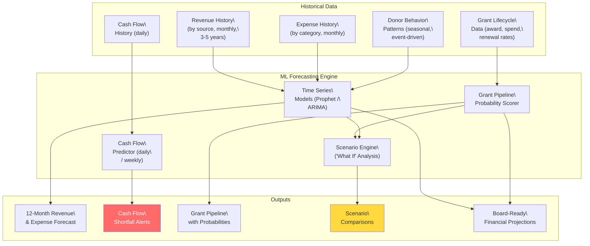

### What It Does

- **Revenue forecasting** — time series model that predicts monthly revenue by source (grants, individual donors, events, contracts) based on historical patterns, seasonality, and current pipeline
- **Cash flow prediction** — daily/weekly cash position forecast that flags shortfalls before they happen. "You will likely hit a cash flow gap in March when two grants end before renewal funding arrives."
- **Grant pipeline scoring** — each pending grant proposal assigned a probability of award based on funder history, proposal competitiveness, and org track record
- **What-if scenarios** — "What happens if the HUD grant doesn't renew? What if we add a $50K campaign? What if we hire 2 more staff?" Instant scenario modeling with visualized impact.
- **Board-ready projections** — automated financial projections formatted for board presentation

### Why It Matters

Most nonprofits operate in a perpetual cash flow anxiety cycle. They do not know if they can make payroll in 3 months. They do not know their actual renewal probability for a grant that represents 30% of revenue. They make hiring decisions based on hope rather than data.

- **Cash flow crises prevented:** Early warning of shortfalls enables proactive fundraising or expense management
- **Better decision-making:** Scenario modeling replaces gut feelings with data-informed projections
- **Board confidence:** Board members see professional financial projections instead of "we think we'll be okay"
- **Grant diversification:** Pipeline probability scoring reveals dangerous concentration risks

### Technical Stack

| Component | Technology |
|---|---|
| Time series forecasting | Facebook Prophet or statsmodels ARIMA |
| Grant probability | Logistic regression on historical award data |
| Cash flow prediction | Rolling forecast model on daily transaction data |
| Scenario engine | Parameterized model with adjustable assumptions |
| Visualization | Plotly, Chart.js, or embedded BI tool |

---

## 11. Smart Board Packets

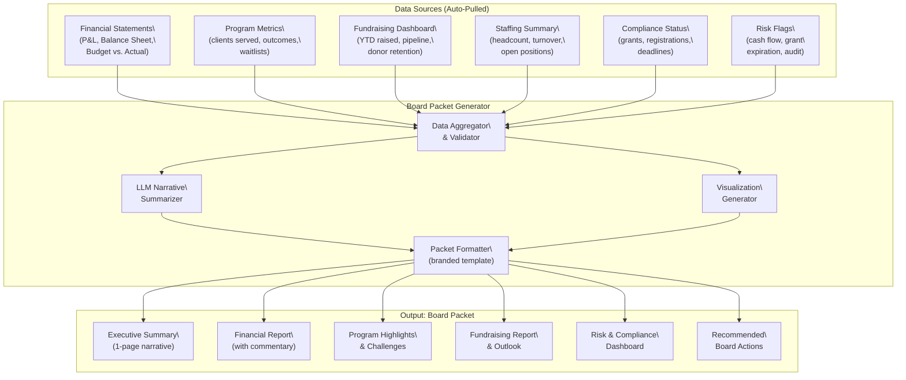

### What It Does

Before every board meeting, the system auto-generates a complete board packet:

- **Executive summary** — a 1-page narrative highlighting the most important developments, written in plain language (not accounting jargon)
- **Financial report** — P&L, balance sheet, budget vs. actual with AI-generated commentary ("Revenue is 8% above budget YTD, driven by a $45K unplanned major gift in October. Expenses are 3% under budget due to a delayed hire in the housing program.")
- **Program highlights** — key metrics, success stories, challenges, and trends across all programs
- **Fundraising report** — YTD fundraising performance, pipeline, donor retention trends, upcoming campaigns
- **Risk dashboard** — cash flow outlook, expiring grants, compliance deadlines, open audit items
- **Recommended actions** — AI-suggested items for board discussion or vote based on current situation

### Why It Matters

Board packet preparation is a 15-30 hour task every month or quarter. The ED, finance director, and program directors all contribute sections, often at the last minute. The result is usually inconsistent in format and incomprehensible to board members who are not nonprofit professionals.

- **Time savings:** 15-30 hours reduced to 3-5 hours of review per cycle
- **Board engagement:** Board members actually read the packet because it is clear, visual, and narrative-driven
- **Consistency:** Same format every meeting — board members know where to find what they need
- **Governance quality:** Better-informed board members make better decisions

### Technical Stack

| Component | Technology |
|---|---|
| Data aggregation | Integration layer queries across all systems |
| Narrative generation | Claude API or GPT-4 |
| Visualization | Chart.js, D3, or Plotly for auto-generated charts |
| Template/formatting | Branded PDF/HTML template with dynamic sections |
| Delivery | Email with PDF attachment + optional board portal |

---

## 12. Compliance Autopilot

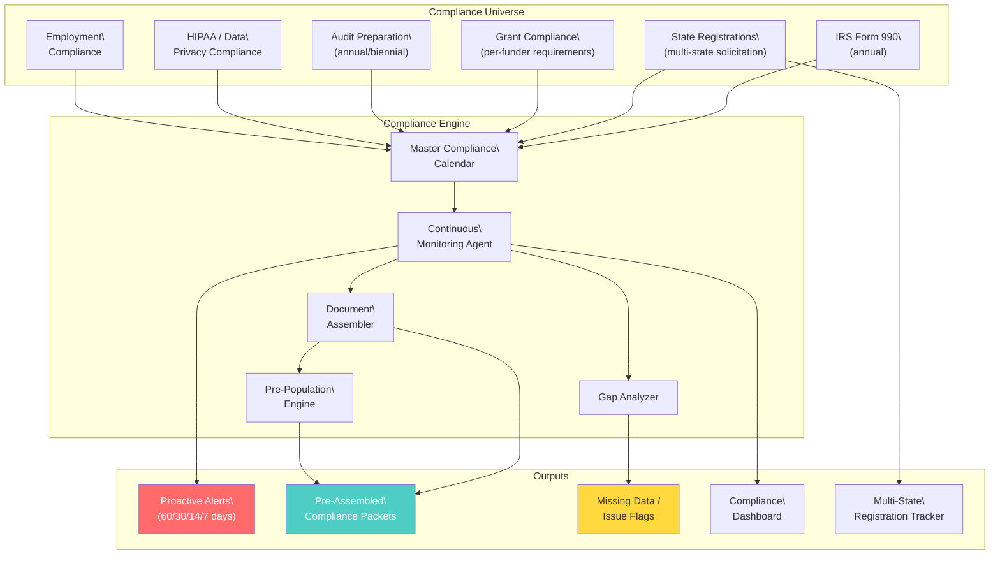

### What It Does

- **Master compliance calendar** — every deadline for every requirement across IRS, state registrations, funder reports, audits, and employment law
- **Proactive alerts** — notifications at 60, 30, 14, and 7 days before each deadline, escalating in urgency
- **Document assembly** — automatically gathers and organizes documentation for each compliance requirement from integrated systems
- **990 pre-population** — pulls financial data, board member info, program descriptions, and compensation data into 990 draft fields
- **Multi-state tracking** — for orgs that solicit donations in multiple states, tracks each state's registration deadline, renewal requirements, and filing thresholds
- **Gap analysis** — flags missing data or potential issues weeks before deadlines ("Your 990 is due in 45 days but we don't have updated board member compensation data for 3 members")
- **Audit preparation** — assembles audit workpapers, reconciliations, and supporting documentation ahead of the annual audit

### Why It Matters

Compliance failures have real consequences: loss of tax-exempt status, funder clawbacks, state penalties, and board liability. Most nonprofits manage compliance via spreadsheets and calendar reminders, which means things fall through the cracks.

- **Risk reduction:** Missed 990 deadlines can trigger automatic revocation of tax-exempt status (the IRS revoked 275,000+ nonprofits' status in 2011 for this reason)
- **Multi-state complexity:** An org soliciting in 40 states has 40 different registration deadlines, requirements, and thresholds
- **Audit efficiency:** Pre-assembled audit documentation reduces audit fees (auditors charge by the hour, and disorganized documentation = more hours)
- **Staff time:** Compliance tracking is a part-time job at most nonprofits. Automation reclaims that time.

### Technical Stack

| Component | Technology |
|---|---|
| Compliance database | Structured DB of requirements, deadlines, and filing rules |
| Calendar engine | Cron-based scheduler with escalating notification logic |
| Document assembly | Integration layer data pulls + template population |
| 990 pre-population | Mapping engine from accounting/HR data to 990 field schema |
| Gap analysis | Rule-based engine checking data completeness per requirement |
| Multi-state tracking | Harbor Compliance API or manually curated state requirements DB |

---

## COMMUNICATIONS & CONTENT

---

## 13. AI Content Engine

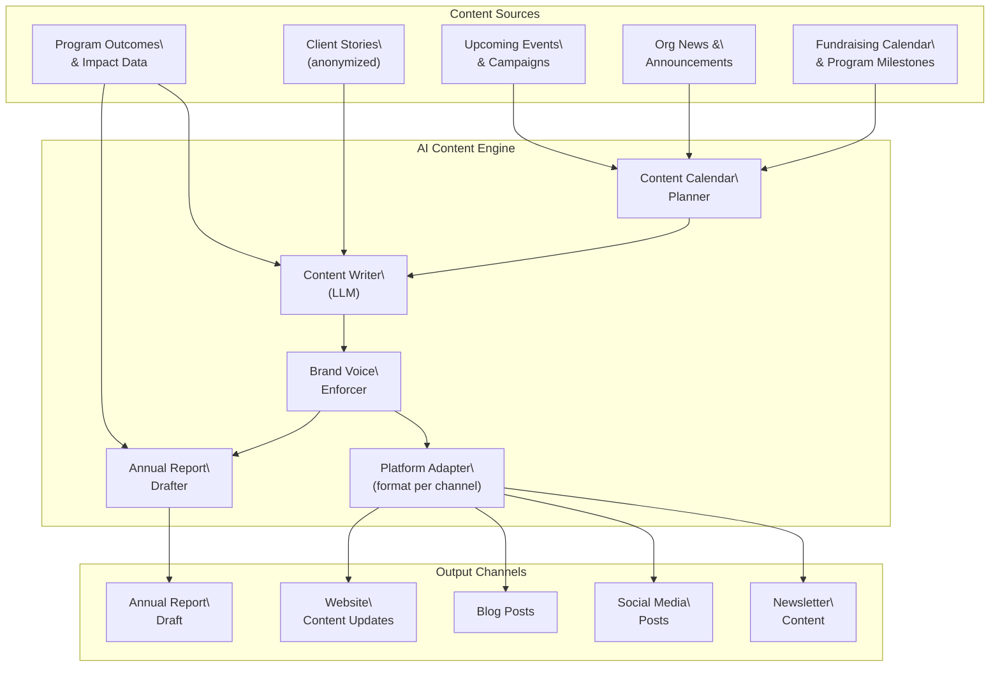

### What It Does

- **Content calendar planning** — suggests a content schedule based on the fundraising calendar (appeal before year-end, gratitude in January), program milestones (program graduating its 100th client), and seasonal hooks
- **Newsletter content** — drafts newsletter articles from program outcomes data and anonymized client stories
- **Social media posts** — generates platform-specific posts (LinkedIn tone vs. Instagram caption vs. Twitter brevity) from the same source material
- **Blog posts** — longer-form content pieces on program impact, policy issues, or organizational updates
- **Annual report draft** — assembles a full annual report narrative from the year's data: financials, program outcomes, donor acknowledgments, board updates
- **Brand voice enforcement** — every piece of content is filtered through the org's voice guidelines (formal vs. casual, preferred terminology, messaging pillars)

### Why It Matters

Content creation is a constant pressure for nonprofit communications teams (which are often 1 person or even 0 — the ED doing it themselves). The result is sporadic posting, generic content, and missed opportunities to share impact.

- **Consistency:** Regular content output even when the comms person is on vacation or drowning in other work
- **Impact storytelling:** Content is grounded in real data, not fluff. "We served 1,247 families this quarter" is more compelling than "we're making a difference"
- **Time savings:** 10-15 hours/week of content creation reduced to 2-3 hours of review and editing
- **Annual report:** The most dreaded communications project — reduced from a 3-month ordeal to a 2-week review process

### Technical Stack

| Component | Technology |
|---|---|
| Content generation | Claude API or GPT-4 with brand voice fine-tuning |
| Calendar planning | Rule-based engine on fundraising/program calendar |
| Platform adaptation | LLM with platform-specific formatting prompts |
| Image suggestions | Integration with Unsplash API or org's photo library |
| Publishing | API integration with Mailchimp, Buffer/Hootsuite, WordPress |

---

## 14. Multilingual Communications

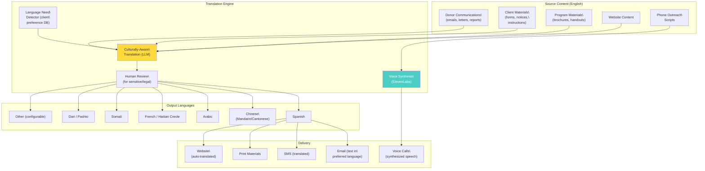

### What It Does

- **Auto-translation of all communications** — every donor email, client notice, program material, and website page translated to the client's or donor's preferred language
- **Culturally-aware translation** — not just word-for-word substitution. The LLM understands cultural context, formality levels, and community-specific terminology. A Somali translation reads like it was written by a Somali speaker, not run through Google Translate.
- **Voice synthesis for outreach** — phone-based outreach (appointment reminders, program updates, benefit notifications) delivered in the client's language via AI-generated voice
- **Client language preference tracking** — each client's preferred language stored in their profile, automatically applied to all outgoing communications
- **Human review workflow** — sensitive or legal content (consent forms, rights notifications) flagged for human translator review before delivery

### Why It Matters

For organizations serving immigrant and refugee communities, language access is not a nice-to-have — it is a civil rights requirement (Title VI of the Civil Rights Act for any org receiving federal funds) and a practical necessity.

- **Access:** Clients who receive information in their language are 3x more likely to follow through on services
- **Compliance:** Title VI requires meaningful language access for LEP (Limited English Proficiency) clients
- **Cost reduction:** Professional translation services cost $0.15-0.30/word. A 10-page document in 5 languages = $7,500-15,000. AI translation reduces this to review costs only.
- **Speed:** Urgent communications (benefit deadline notices, emergency alerts) translated in minutes, not days

### Technical Stack

| Component | Technology |
|---|---|
| Translation | Claude API, GPT-4, or DeepL with cultural context prompting |
| Voice synthesis | ElevenLabs API (multilingual voice cloning) |
| Language detection | Client preference DB + automatic detection for new clients |
| Human review | Workflow queue for sensitive/legal content |
| Delivery | Integration layer (Doc 2) for email, SMS, print, phone |

---

## 15. Chatbot for Client Self-Service

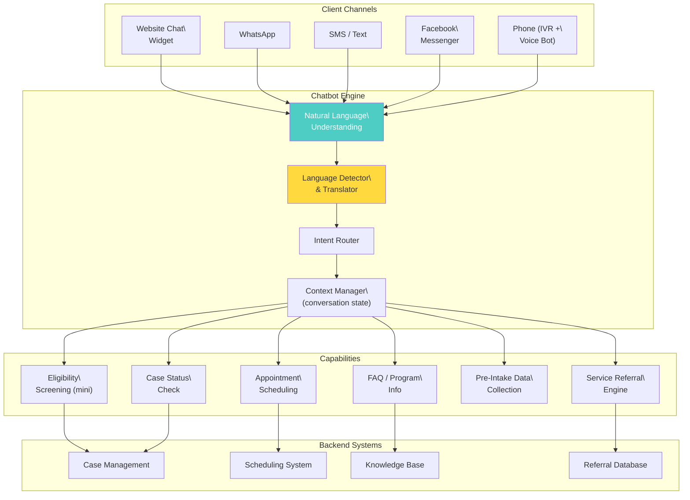

### What It Does

A multilingual chatbot available 24/7 across multiple channels that can:

- **Answer eligibility questions** — "Am I eligible for your housing program?" The bot asks qualifying questions and gives a preliminary answer.
- **Schedule appointments** — "I need to see a case worker." The bot checks availability and books the appointment.
- **Check case status** — "What's happening with my application?" Authenticated clients can check their case status without calling the office.
- **Provide referrals** — "I need help with my electric bill." The bot identifies the need and provides referrals to partner organizations or internal programs.
- **Collect pre-intake data** — Before a scheduled appointment, the bot collects basic information so the case worker's time is spent on assessment, not data entry.
- **Answer FAQs** — Program hours, locations, required documents, application processes — all without a human.

### Why It Matters

Nonprofit front desks and phone lines are overwhelmed. Staff spend hours answering the same questions: "What are your hours?" "What documents do I need?" "Am I eligible?" Meanwhile, clients who work during business hours cannot access services at all.

- **Staff time reclaimed:** 40-60% of incoming inquiries are routine questions the bot can handle = reclaiming 15-25 hours/week of staff time
- **24/7 access:** Clients can interact at midnight, on weekends, whenever they have time
- **No-show reduction:** Pre-intake data collection and appointment reminders reduce no-show rates by 20-30%
- **Language access:** Bot operates in any supported language, eliminating the need for interpreter scheduling for routine interactions

### Technical Stack

| Component | Technology |
|---|---|
| Chatbot framework | Botpress, Voiceflow, or custom (LangChain + LLM) |
| NLU/LLM | Claude API or GPT-4 for conversation management |
| Channel integration | Twilio (SMS, WhatsApp, Voice), Meta Messenger API, web widget |
| Scheduling | Calendly API, Acuity, or custom scheduling integration |
| Knowledge base | Vector DB with RAG over program documentation |
| Authentication | Client ID + DOB verification for status checks |

---

## PROGRAM OPTIMIZATION

---

## 16. Outcomes Prediction & Program Optimization

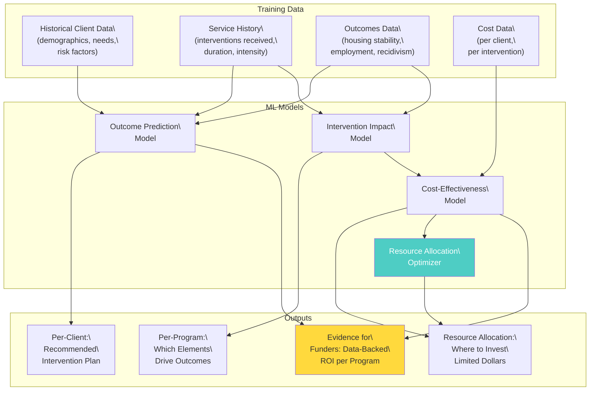

### What It Does

- **Per-client outcome prediction** — given this client's profile (demographics, needs, risk factors), what is the probability of successful outcome with each available intervention? Recommends the intervention most likely to succeed.
- **Intervention impact analysis** — across all historical clients, which program elements have the strongest correlation with positive outcomes? Is it the case management intensity? The job training? The housing subsidy duration?
- **Cost-effectiveness modeling** — for each intervention, what is the cost per successful outcome? Where is the org getting the best return on every dollar spent?
- **Resource allocation optimization** — given a fixed budget, how should resources be distributed across programs and interventions to maximize total impact?
- **Evidence generation** — data-backed ROI narratives for funder reporting: "Our rapid rehousing program achieves housing stability for 73% of participants at a cost of $4,200 per successful outcome, compared to the emergency shelter system cost of $18,000 per person per year."

### Why It Matters

Nonprofits are under increasing pressure to demonstrate outcomes and cost-effectiveness, but most lack the analytical capacity to do so rigorously. Funders are moving toward "pay for outcomes" models. Government contracts increasingly require evidence-based practices.

- **Better outcomes:** Matching clients to the right interventions based on evidence, not intuition
- **Funder confidence:** Data-backed cost-per-outcome gives funders exactly what they want to see
- **Resource optimization:** Limited dollars deployed where they have maximum impact
- **Competitive advantage:** Orgs that can demonstrate outcomes with data win more grants

### Technical Stack

| Component | Technology |
|---|---|
| Outcome prediction | XGBoost / Random Forest on historical client-outcome data |
| Causal analysis | Propensity score matching or instrumental variables for intervention impact |
| Cost modeling | Custom cost allocation engine on accounting + program data |
| Optimization | Linear programming (PuLP/OR-Tools) for resource allocation |
| Visualization | Dashboard with drill-down (Metabase, Superset, or custom) |

---

## 17. Smart Scheduling & Resource Allocation

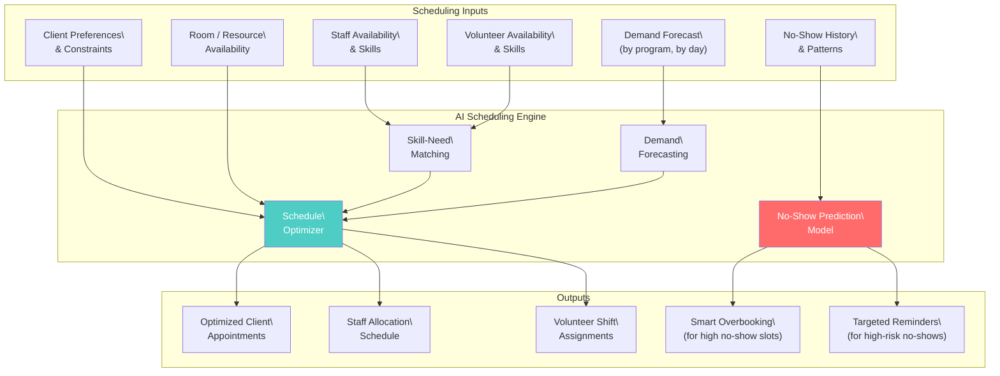

### What It Does

- **No-show prediction** — which appointments are at high risk of no-show? The model uses historical patterns (client, time of day, day of week, weather, appointment type) to flag high-risk slots. Those clients get extra reminders, and the schedule is overbooked for high no-show time slots.
- **Skill-need matching** — for volunteer shifts and staff assignments, match skills and certifications to program needs (Spanish-speaking volunteer for the ESL class, licensed counselor for the mental health intake, etc.)
- **Demand forecasting** — predict walk-in traffic and service demand by program, day, and time. Staff accordingly.
- **Schedule optimization** — given all constraints (staff availability, room capacity, client preferences, travel time between sites), generate an optimal schedule

### Why It Matters

No-shows are a massive problem for nonprofits — rates of 20-40% are common, and every no-show wastes a staff member's time slot. Meanwhile, volunteer coordination is a part-time job that most orgs do manually via spreadsheets and email chains.

- **No-show reduction:** Targeted reminders for high-risk appointments reduce no-shows by 20-30%
- **Utilization:** Smart overbooking fills slots that would otherwise go empty
- **Volunteer satisfaction:** Volunteers assigned to roles that match their skills stay longer
- **Staff efficiency:** Demand-based staffing prevents both burnout (understaffed days) and waste (overstaffed days)

### Technical Stack

| Component | Technology |
|---|---|
| No-show prediction | Logistic regression or gradient boosting on appointment history |
| Demand forecasting | Prophet time series on historical traffic data |
| Schedule optimization | Constraint programming (OR-Tools, OptaPlanner) |
| Matching | Bipartite matching algorithm for skill-need pairing |
| Reminders | Twilio SMS/voice integration triggered by risk score |

---

## 18. Geospatial Impact Analysis

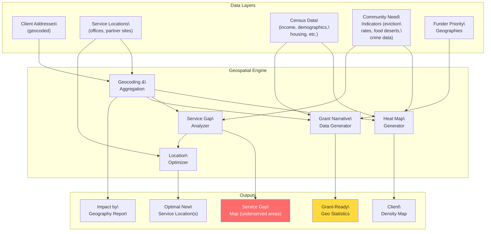

### What It Does

- **Client density mapping** — where do clients live? Heat map overlay showing service utilization by geography
- **Service gap analysis** — overlay client locations against community need indicators. Where are there high-need neighborhoods with low service utilization? These are underserved areas.
- **Location optimization** — if the org is opening a new site, where should it be located to maximize reach and fill service gaps?
- **Grant narrative data** — auto-generates geographic context for grant applications: "72% of our clients come from ZIP codes 78702, 78741, and 78744, where the median household income is $28,400 and the eviction rate is 3.2x the city average."
- **Impact by geography** — report showing outcomes mapped to neighborhoods, enabling place-based analysis

### Why It Matters

Funders increasingly want to see place-based evidence. Government grants often require demonstration of need in specific geographies. Nonprofits that can show WHERE they work and WHY have a massive advantage in grant applications.

- **Grant competitiveness:** Geographic data transforms generic need statements into compelling, specific evidence
- **Strategic planning:** Data-driven decisions about where to expand services
- **Equity analysis:** Identify whether the org is actually reaching the most underserved communities or missing them
- **Funder alignment:** Match geographic focus to funder priorities

### Technical Stack

| Component | Technology |
|---|---|
| Geocoding | Google Maps Geocoding API or Mapbox |
| Mapping | Mapbox GL, Leaflet, or Kepler.gl |
| Census data | US Census Bureau API (ACS data) |
| Need indicators | HUD, USDA Food Access Research Atlas, local open data portals |
| Spatial analysis | PostGIS or Turf.js |
| Visualization | Interactive web maps with drill-down capability |

---

## TEMPLATES & QUICK WINS

---

## 19. Pre-Built Templates Library

Every template below ships with the framework and is designed to auto-populate from integrated data wherever possible.

### Grant Templates

| Template | Description | Auto-Populated Fields |
|---|---|---|
| **Federal Grant Budget Template** | OMB-compliant budget format with categories for personnel, fringe, travel, equipment, supplies, contractual, other, indirect | Salary data from HR, fringe rates from payroll, indirect rate from accounting |
| **Foundation Narrative Template** | Standard narrative sections (org background, need statement, project description, evaluation plan, sustainability) with merge fields | Org description, client demographics, outcome statistics, financial data |
| **Grant Tracking Dashboard** | Live dashboard showing all grants: status, amount, period, reporting deadlines, spending vs. budget | All fields from accounting and grant management data |
| **LOI (Letter of Intent) Template** | 1-2 page template for foundation LOIs with org summary, project overview, and budget summary | Org profile, recent outcomes, budget summary |

### Board Templates

| Template | Description | Auto-Populated Fields |
|---|---|---|
| **Monthly Board Packet** | Complete board packet with executive summary, financials, program highlights, fundraising update, compliance status | All fields from integrated systems |
| **Financial Dashboard** | Visual dashboard with P&L, balance sheet, budget vs. actual, cash position, grant burn rates | All fields from accounting |
| **Annual Board Report** | Year-in-review for board with financial summary, program outcomes, strategic progress | Full-year data from all systems |
| **Board Meeting Minutes** | Structured minutes template with attendance, motions, votes, action items, next meeting | Board member roster, agenda items |

### Donor Templates

| Template | Description | Auto-Populated Fields |
|---|---|---|
| **Tax Receipt** | IRS-compliant donation acknowledgment letter (auto-generated on gift receipt) | Donor name, gift amount, date, fund designation, org tax ID |
| **Personalized Impact Report** | Individual impact narrative connecting donor's gifts to program outcomes | Giving history, fund designations, program outcomes |
| **Annual Appeal Letter** | Year-end fundraising appeal with personalized salutation, giving history, and impact data | Donor name, last gift, total giving, relevant outcomes |
| **Major Donor Cultivation Plan** | 12-month cultivation plan with touchpoints, meetings, events, and ask strategy | Giving history, engagement history, wealth screening data |

### Program Templates

| Template | Description | Auto-Populated Fields |
|---|---|---|
| **Client Intake Form** | Digital, multilingual intake form with conditional logic based on service type | Existing client data if returning client |
| **Case Notes Template** | Structured case notes with service type, duration, outcomes, follow-up actions | Client ID, case worker, date, program |
| **Outcomes Tracking Template** | Program outcomes tracker with inputs, outputs, outcomes, and indicators | Program targets, current actuals from case management |
| **Referral Tracking Template** | Track referrals sent and received with status, follow-up, and outcome | Client ID, referring org, receiving org, service type |

### Operations Templates

| Template | Description | Auto-Populated Fields |
|---|---|---|
| **990 Data Preparation Checklist** | Step-by-step checklist for assembling 990 data with field mappings | Financial data, board info, compensation, program descriptions |
| **Audit Preparation Checklist** | Comprehensive audit prep checklist with document list and status tracking | Account balances, reconciliations, grant schedules |
| **Employee Onboarding Checklist** | New hire onboarding with IT setup, policy acknowledgments, benefits enrollment, training | Employee data from HR |
| **Volunteer Onboarding Checklist** | Volunteer onboarding with background check, training, scheduling, role assignment | Volunteer profile from volunteer management |

### Compliance Templates

| Template | Description | Auto-Populated Fields |
|---|---|---|
| **Multi-State Registration Tracker** | Track charitable solicitation registrations across all 41 requiring states | Registration dates, renewal deadlines, filing thresholds |
| **Grant Compliance Calendar** | All grant reporting and compliance deadlines with status and responsible party | Grant data from accounting, reporting templates from funder DB |
| **HIPAA Compliance Checklist** | For orgs handling health information: policies, training, technical safeguards, BAAs | Staff training status, system inventory |
| **Data Security Policy Template** | Org-wide data security policy covering access, encryption, retention, breach response | System inventory, staff roles |

---

## 20. The "Day One" Package

What a nonprofit gets immediately upon adoption — before any AI features are configured. This is the instant value proposition.

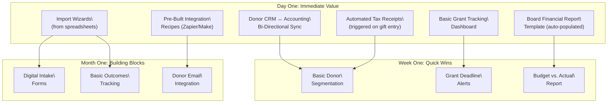

### Day One Includes:

1. **Connected Donor CRM to Accounting Sync** — gifts entered in the CRM automatically create revenue entries in accounting with proper fund coding. No more double-entry.
2. **Automated Tax Receipts** — every gift triggers an IRS-compliant donation acknowledgment letter sent to the donor. Staff never manually generates a tax receipt again.
3. **Basic Grant Tracking Dashboard** — see all active grants, amounts, periods, spending to date, and upcoming deadlines in one view.
4. **Board Financial Report Template** — pre-built template that pulls from accounting to generate a board-ready financial summary (P&L, balance sheet, budget vs. actual).
5. **Pre-Built Integration Recipes** — Zapier/Make templates for common tool combinations: "When a new donation is entered in Bloomerang, create a transaction in QuickBooks" or "When a grant report is due in 30 days, send a Slack notification."
6. **Import Wizards** — guided import tools for migrating data from spreadsheets (the universal nonprofit database) into the structured system. Column mapping, deduplication, validation.

### Why This Matters

AI features are exciting but require data quality and integration maturity. The Day One package delivers immediate, tangible value that:
- Eliminates the most painful manual processes (double-entry, manual receipts)
- Creates the data foundation that AI features will later consume
- Builds staff trust in the system before introducing more advanced features
- Provides ROI within the first week, not the first quarter

---

## 21. Value Matrix

The following matrix evaluates every feature described in this document across build complexity, impact, dependencies, estimated effort, and target maturity level.

### Maturity Level Reference

| Level | Description |
|---|---|
| **Level 1** | Spreadsheet-dependent, minimal systems |
| **Level 2** | Basic tools in place (CRM, accounting) but not integrated |
| **Level 3** | Integrated systems with clean data, ready for automation |
| **Level 4** | Mature data infrastructure, ready for advanced AI/ML |

### Feature Value Matrix

| # | Feature | Build Complexity | Impact | Dependencies | Effort | Best Maturity Level |
|---|---|---|---|---|---|---|
| **INTAKE & CLIENT SERVICES** | | | | | | |
| 2 | AI-Powered Intake Forms | High | High | Speech-to-text API, translation API, case management integration | 2-3 months | Level 3-4 |
| 3 | Intelligent Case Matching & Routing | High | High | Historical outcomes data, vector DB, case management integration | 2-3 months | Level 4 |
| 4 | Benefits Eligibility Screening (LLM) | High | **Very High** | LLM API, benefits rules DB (built or licensed), intake integration | 2-3 months | Level 2-4 |
| **FUNDRAISING & DONOR ENGAGEMENT** | | | | | | |
| 5 | AI Donor Intelligence | Medium-High | High | 2+ years of donor data, CRM integration, wealth screening API | 1-2 months | Level 3-4 |
| 6 | Personalized Impact Reports | Medium | High | CRM + case management integration, LLM API, template engine | 1-2 months | Level 3 |
| 7 | AI Grant Writing Assistant | High | High | Vector DB of past proposals, LLM API, accounting + program data integration | 2-3 months | Level 3-4 |
| 8 | Smart Fundraising Campaigns | Medium | Medium-High | CRM integration, LLM API, email platform integration | 1-2 months | Level 3 |
| **OPERATIONS & REPORTING** | | | | | | |
| 9 | Auto-Generated Grant Reports | Medium-High | **Very High** | Funder template DB, accounting + case management + HR integration, LLM API | 1-2 months | Level 3 |
| 10 | Intelligent Financial Forecasting | Medium | High | 2+ years financial history, accounting integration | 1 month | Level 3-4 |
| 11 | Smart Board Packets | Medium | Medium-High | All system integrations, LLM API, template engine | 1 month | Level 3 |
| 12 | Compliance Autopilot | Medium | High | Compliance rules DB, all system integrations | 1-2 months | Level 2-3 |
| **COMMUNICATIONS & CONTENT** | | | | | | |
| 13 | AI Content Engine | Medium | Medium | Program data integration, LLM API, publishing integrations | 1 month | Level 2-3 |
| 14 | Multilingual Communications | Medium | High | Translation API, voice synthesis API, client language preferences | 1 month | Level 2-4 |
| 15 | Chatbot for Client Self-Service | Medium-High | High | Case management integration, scheduling integration, knowledge base | 1-2 months | Level 2-3 |
| **PROGRAM OPTIMIZATION** | | | | | | |
| 16 | Outcomes Prediction & Optimization | High | High | 3+ years of client outcome data, case management integration | 2-3 months | Level 4 |
| 17 | Smart Scheduling & Resource Allocation | Medium | Medium | Scheduling system, historical appointment data | 1 month | Level 2-3 |
| 18 | Geospatial Impact Analysis | Medium | Medium-High | Geocoded client data, Census API, mapping library | 1 month | Level 2-4 |
| **TEMPLATES & QUICK WINS** | | | | | | |
| 19 | Pre-Built Templates Library | Low-Medium | High | Basic system integrations | 1-2 weeks per template batch | Level 1-4 |
| 20 | Day One Package | Low-Medium | **Very High** | CRM + accounting integration (Doc 2 baseline) | 1 month | Level 1-2 |

### Prioritization Quadrant

```mermaid
quadrantChart
    title Build Priority: Impact vs. Complexity
    x-axis Low Complexity --> High Complexity
    y-axis Low Impact --> High Impact
    quadrant-1 Build Next (High Impact, High Complexity)
    quadrant-2 Build First (High Impact, Low Complexity)
    quadrant-3 Build Later (Low Impact, Low Complexity)
    quadrant-4 Evaluate (Low Impact, High Complexity)
    Day One Package: [0.25, 0.90]
    Templates Library: [0.30, 0.75]
    Auto Grant Reports: [0.55, 0.92]
    Benefits Screening: [0.80, 0.95]
    Compliance Autopilot: [0.45, 0.72]
    Donor Intelligence: [0.60, 0.78]
    Impact Reports: [0.45, 0.75]
    Board Packets: [0.40, 0.65]
    Content Engine: [0.38, 0.52]
    Multilingual Comms: [0.42, 0.70]
    Financial Forecasting: [0.40, 0.73]
    Chatbot: [0.58, 0.70]
    Smart Campaigns: [0.48, 0.62]
    AI Intake Forms: [0.75, 0.80]
    Grant Writing Assistant: [0.78, 0.78]
    Case Matching: [0.82, 0.80]
    Outcomes Prediction: [0.85, 0.75]
    Smart Scheduling: [0.40, 0.55]
    Geospatial Analysis: [0.42, 0.60]
```

### Recommended Build Order

| Phase | Features | Timeline | Rationale |
|---|---|---|---|
| **Phase 1: Foundation** | Day One Package, Templates Library | Month 1-2 | Immediate value, builds trust, creates data foundation |
| **Phase 2: Operations** | Auto Grant Reports, Compliance Autopilot, Board Packets, Financial Forecasting | Month 2-4 | Massive time savings on universally painful tasks |
| **Phase 3: Fundraising** | Donor Intelligence, Personalized Impact Reports, Smart Campaigns | Month 4-6 | Revenue impact, addresses 46% retention crisis |
| **Phase 4: Communications** | Content Engine, Multilingual Comms, Chatbot | Month 5-7 | Scalable engagement across channels and languages |
| **Phase 5: Client Services** | Benefits Eligibility Screening, AI Intake Forms, Case Matching | Month 6-9 | Highest impact features, but require mature data |
| **Phase 6: Advanced** | Grant Writing Assistant, Outcomes Prediction, Smart Scheduling, Geospatial Analysis | Month 8-12 | Advanced ML features that require significant historical data |

---

## Summary: What This All Adds Up To

When you layer these AI/ML features on top of the integration backbone from Doc 2, a nonprofit goes from:

| Without | With |
|---|---|
| 45-minute paper intake in English only | 15-minute voice intake in any language |
| Case workers manually checking 50 benefit programs | LLM screens all programs in 15 minutes |
| 20+ hours per grant report | 2 hours of review |
| 15-30 hours per board packet | 3-5 hours of review |
| Generic "Dear Friend" donor communications | Personalized impact reports for every donor |
| 46% donor retention (sector average) | 55-65% retention with predictive intervention |
| First grant draft in 2 weeks | First draft in 2 hours |
| Compliance tracked on spreadsheets | Automated monitoring with proactive alerts |
| Content created when someone has time | Consistent, data-driven content calendar |
| English-only communications | Every communication in every client's language |
| Gut-feeling program decisions | Data-backed outcome predictions and resource optimization |

The total estimated staff time savings across all features: **500-1,000 hours per year** for a mid-sized nonprofit (budget $1M-5M, staff 15-50). That is 6-12 FTE-months of capacity returned to mission-critical work.

This is the sugar on top. But it only works if the wiring underneath (Doc 2) is solid. Data in, intelligence out. No shortcuts.
"}}],"stop_reason":null,"stop_sequence":null,"usage":{"input_tokens":1,"cache_creation_input_tokens":164,"cache_read_input_tokens":11339,"cache_creation":{"ephemeral_5m_input_tokens":0,"ephemeral_1h_input_tokens":164},"output_tokens":25,"service_tier":"standard"}},"requestId":"req_011CXjyhXFpvPN8yU6gDhRKq","type":"assistant","uuid":"42a03456-0c85-404e-a9d7-d1ba399ad2d4","timestamp":"2026-02-02T21:55:18.284Z"}
{"parentUuid":"42a03456-0c85-404e-a9d7-d1ba399ad2d4","isSidechain":true,"userType":"external","cwd":"/Users/dev/Desktop/non-prof","sessionId":"f0de89b8-d87d-40d5-abe6-c82c13d33095","version":"2.1.29","gitBranch":"","agentId":"a9f4657","slug":"parsed-herding-bird","type":"user","message":{"role":"user","content":[{"type":"tool_result","content":"